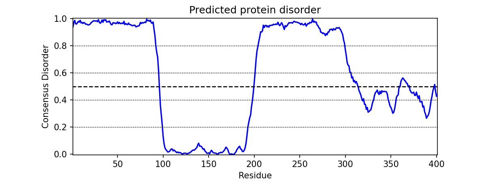
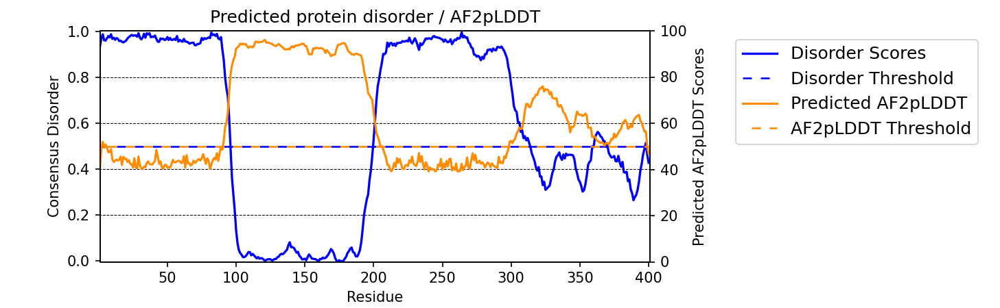
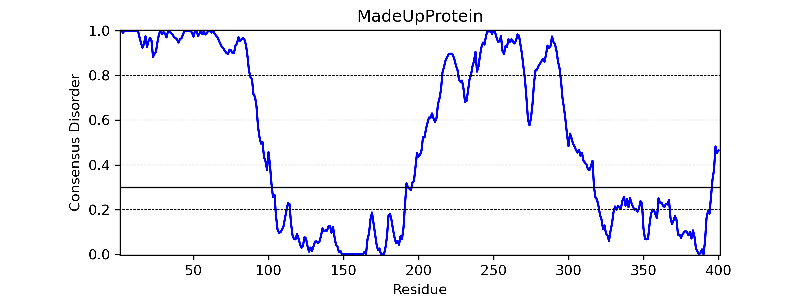

**********************
metapredict in Python
**********************

In addition to using metapredict from the command line, you can also use it directly in Python. This enables metapredict to be incorporated into your bioinformatic workflows with ease

First import metapredict:

.. code-block:: python

	import metapredict as meta

Once metapredict is imported, you can work with individual sequences or .fasta files. :doc:`For a list of all metapredict's public-facing functions and their documentation click here  <api>`

Important updates
====================

Update to metapredict V3.1 (October 2026)
~~~~~~~~~~~~~~~~~~~~~~~~~~~~~~~~~~~~~~~~~~~~

V3.1 adds new functionality and changes a few defaults. The main changes for Python users are:

* **Automatic device selection now depends on the network.** When you don't set ``device``, a CUDA GPU is always used first if one is available. After that, the default V3 disorder network and the pLDDT networks use an Apple Silicon GPU (MPS) if there is one, while the much smaller V1 and V2 disorder networks use the CPU, because they run faster on the CPU than on MPS. Single sequences are still always predicted on the CPU. See *Selecting a specific device to use for predictions* below.
* **New** ``batch_size`` **option** for :code:`predict_disorder()`, :code:`predict_pLDDT()`, :code:`predict_disorder_batch()` and :code:`predict_disorder_stream()`, along with new default batch sizes chosen per network and per device. Several defaults are now larger (most notably for the V1 and V2 disorder networks, which used to use batches of 32), which makes batch prediction faster but uses more memory; see *Setting the batch size* below and the :doc:`FAQ <../faq>`.
* **New** :code:`predict_disorder_stream()` **function** for predicting disorder from FASTA files that are too large to fit in memory (see *Streaming disorder predictions for very large FASTA files* below).
* Empty sequences now raise a :code:`MetapredictError` that names them, and :code:`MetapredictError` can now be imported directly from ``metapredict`` (see *Handling errors* below).
* ``override_folded_domain_minsize`` is now honoured when ``return_domains=True``, and :code:`predict_disorder_batch()` now honours ``normalized``.
* On NVIDIA GPUs, predictions now match CPU predictions much more closely (see the GPU precision note below).
* :code:`predict_disorder_caid()` now replaces characters that aren't allowed in file names (such as the ``|`` in UniProt headers) when naming its output files.

Update to metapredict V3 (November 2024)
~~~~~~~~~~~~~~~~~~~~~~~~~~~~~~~~~~~~~~~~~~~

In November 2024 we updated the default version of metapredict to be V3. V3 introduces a few new changes including increased speed for all disorder and pLDDT predictions on CPU or GPU **and new networks for pLDDT and disorder prediction**. The new default network for disorder prediction is V3. The new default network for pLDDT prediction is V2. Furthermore, V3 introduces simplification to our Python functionality in that :code:`predict_disorder()` now offers functionality for individual predictions and batch predictions for all metapredict networks. In addition, the same functionality now applies to :code:`predict_pLDDT()`, enabling massive increases in pLDDT prediction. 
		
If a GPU is available, batch prediction will automatically use it — metapredict checks for a CUDA GPU first, then Apple Silicon MPS, and otherwise falls back to CPU (as of V3.1, the smaller V1 and V2 disorder networks use the CPU rather than MPS; see below). While all the original functionality is preserved, :code:`predict_disorder()`, offers a 5-10x speedup on CPUs and 30-40x speedup on GPUs.

:code:`predict_disorder()` can **as of v3** take in a single sequence, a list of sequences or a dictionary of sequences, and returns individual scores, a list or dictionary that maps input index back to a two-position list of sequence and disorder scores or, if :code:`return_domains` is set to True, metapredict will return :code:`DisorderObject` objects.

This functionality is described in detail in the function documentation under the Python Module Documentation entry for :code:`predict_disorder()`.

Note - all functionanlity previously only in :code:`predict_disorder_batch()` is now in :code:`predict_disorder()` for disorder prediction and :code:`predict_pLDDT()` for pLDDT score prediction. However, for V3 we decided to maintain backwards compatibility with V2 so the :code:`predict_disorder_batch()` still works, it's just not necessary. We plan to deprecate this functionality in the future as it is now redundant.

Predicting Disorder
====================

The ``predict_disorder()`` function can take in an individual sequence as a string, a list of sequences, or a dictionary of sequences where the key for each sequence is the name of that sequence and the value in the dictionary is the corresponding sequence. Depending on your input, metapredict will return **for single sequences:** a numpy array (or a list, if ``return_numpy=False``) of predicted disorder consensus values for the residues of the input sequence, **for a list of sequences:** a nested list where the first value in each sublist is the sequence and the second value in each sublist is a list or numpy array of disorder values, and **for a dictionary of sequences:** a dictionary where the key is the name of the sequence and the value is a list where the first element in the list is the sequence and the second value in the list is a list or numpy array of disorder values. 

Example of usage:
~~~~~~~~~~~~~~~~~~

**Predicting disorder for a single sequence**  
  
.. code-block:: python
	
	meta.predict_disorder("DSSPEAPAEPPKDVPHDWLYSYVFLTHHPADFLR")

would output -

.. code-block:: python
	
	array([0.8173, 0.8311, 0.8276, 0.8193, 0.8036, 0.7832, 0.7485, 0.708 ,
       0.6778, 0.64  , 0.5948, 0.5439, 0.5062, 0.47  , 0.448 , 0.4356,
       0.412 , 0.3687, 0.3294, 0.2986, 0.2724, 0.2543, 0.238 , 0.227 ,
       0.2185, 0.2084, 0.1846, 0.1665, 0.1559, 0.1373, 0.124 , 0.1133,
       0.0958, 0.0738], dtype=float32)

**Predicting disorder for a list of sequences**  
  
.. code-block:: python

	sequences=['GSGSGSGSSGSGSGS', 'DSSPEAPAEPPKDVPHDWLYSYVFLTHHPADFLR']
	meta.predict_disorder(sequences)

would output -

.. code-block:: python
	
	[['GSGSGSGSSGSGSGS', array([0.8916, 0.9393, 0.9505, 0.9596, 0.9618, 0.9639, 0.9623, 0.9589,
       0.9517, 0.9371, 0.917 , 0.8955, 0.8827, 0.8773, 0.8686],
      dtype=float32)], ['DSSPEAPAEPPKDVPHDWLYSYVFLTHHPADFLR', array([0.8173, 0.8311, 0.8276, 0.8193, 0.8036, 0.7832, 0.7485, 0.708 ,
       0.6778, 0.64  , 0.5948, 0.5439, 0.5062, 0.47  , 0.448 , 0.4356,
       0.412 , 0.3687, 0.3294, 0.2986, 0.2724, 0.2543, 0.238 , 0.227 ,
       0.2185, 0.2084, 0.1846, 0.1665, 0.1559, 0.1373, 0.124 , 0.1133,
       0.0958, 0.0738], dtype=float32)]]

**Predicting dictionaries of sequences**  

.. code-block:: python

	sequences={'seq1':'GSGSGSGSSGSGSGS', 'seq2':'DSSPEAPAEPPKDVPHDWLYSYVFLTHHPADFLR'}
	meta.predict_disorder(sequences)

would output -

.. code-block:: python
	
	{'seq1': ['GSGSGSGSSGSGSGS', array([0.8916, 0.9393, 0.9505, 0.9596, 0.9618, 0.9639, 0.9623, 0.9589,
       0.9517, 0.9371, 0.917 , 0.8955, 0.8827, 0.8773, 0.8686],
      dtype=float32)], 'seq2': ['DSSPEAPAEPPKDVPHDWLYSYVFLTHHPADFLR', array([0.8173, 0.8311, 0.8276, 0.8193, 0.8036, 0.7832, 0.7485, 0.708 ,
       0.6778, 0.64  , 0.5948, 0.5439, 0.5062, 0.47  , 0.448 , 0.4356,
       0.412 , 0.3687, 0.3294, 0.2986, 0.2724, 0.2543, 0.238 , 0.227 ,
       0.2185, 0.2084, 0.1846, 0.1665, 0.1559, 0.1373, 0.124 , 0.1133,
       0.0958, 0.0738], dtype=float32)]}

Additional Usage:
~~~~~~~~~~~~~~~~~~~

Disabling prediction value normalization
------------------------------------------
By default, output prediction values are normalized between 0 and 1. However, some of the raw values from the predictor are slightly less than 0 or slightly greater than 1. The negative values are simply replaced with 0 and the values greater than 1 are replaced with 1 by default. However, you can disable this by setting ``normalized=False`` when you call ``meta.predict_disorder()``. There is not a very good reason to do this, and it is generally not recommended.

.. code-block:: python
	
	meta.predict_disorder("DSSPEAPAEPPKDVPHDWLYSYVFLTHHPADFLR", normalized=False)

Turning off rounding
----------------------
By default, disorder scores are rounded to 4 decimal places. If you want the unrounded values, set ``round_values=False``.

.. code-block:: python

	meta.predict_disorder("DSSPEAPAEPPKDVPHDWLYSYVFLTHHPADFLR", round_values=False)

Using the different versions of the metapredict network
------------------------------------------------------------
V3 is the default metapredict network for disorder prediction. To use the original metapredict network (previously referred to as 'legacy'), simply set ``version=1``. 

**Example:** 

.. code-block:: python
    
    meta.predict_disorder("DSSPEAPAEPPKDVPHDWLYSYVFLTHHPADFLR", version=1)

To use the V2 metapredict network, simply set ``version=2``.

**Example:** 

.. code-block:: python
    
    meta.predict_disorder("DSSPEAPAEPPKDVPHDWLYSYVFLTHHPADFLR", version=2)

You can give the version as an integer or as a string, so ``version=1``, ``version='1'``, ``version='v1'`` and ``version='V1'`` all select the V1 network.

Selecting a specific device to use for predictions
------------------------------------------------------
If you are predicting a single sequence (passed as a string), metapredict will just use the CPU. The ``device`` name is still checked, so a misspelled device raises an error, but the device doesn't need to be available. However, if you input a list or dictionary of sequences, metapredict will automatically look for a GPU to increase the speed of disorder prediction. A CUDA GPU is always used first if one is available. After that, the order depends on the network: the default V3 network checks devices in the order CUDA → MPS (Apple Silicon) → CPU and uses the first one that is available, while the much smaller V1 and V2 networks use a CUDA GPU if there is one and otherwise the CPU (they run faster on the CPU than on an Apple Silicon GPU, so they never pick MPS automatically). You can also 'force' metapredict to use a specific device if you'd like, or select a particular GPU by index if you have several available.

**Example - predicting on CPU:** 

.. code-block:: python

    sequences=['GSGSGSGSSGSGSGS', 'DSSPEAPAEPPKDVPHDWLYSYVFLTHHPADFLR']
    meta.predict_disorder(sequences, device='cpu')

**Example - predicting on CUDA-enabled GPU:** 

.. code-block:: python

    sequences=['GSGSGSGSSGSGSGS', 'DSSPEAPAEPPKDVPHDWLYSYVFLTHHPADFLR']
    meta.predict_disorder(sequences, device='cuda')

**Example - predicting on first CUDA-enabled GPU:** 

.. code-block:: python

    sequences=['GSGSGSGSSGSGSGS', 'DSSPEAPAEPPKDVPHDWLYSYVFLTHHPADFLR']
    meta.predict_disorder(sequences, device=0)

**Example - predicting on MacOS GPU (MPS):** 

.. code-block:: python

    sequences=['GSGSGSGSSGSGSGS', 'DSSPEAPAEPPKDVPHDWLYSYVFLTHHPADFLR']
    meta.predict_disorder(sequences, device='mps')

``device`` can be ``'cpu'``, ``'cuda'``, ``'mps'``, ``'cuda:N'`` or an integer ``N``, where the last two both select the CUDA GPU with index ``N`` (counting from 0). If you ask for a device that isn't available, metapredict raises a :code:`MetapredictError` rather than quietly falling back to the CPU. Sequences predicted on a CUDA GPU can be at most 65,535 residues long, so use the CPU for anything longer.

.. note::

   **GPU precision.** Scores predicted on a GPU can differ very slightly from
   CPU scores because of floating-point differences between the devices, so
   use ``device='cpu'`` if you need bit-for-bit reproducible scores. On NVIDIA
   GPUs, PyTorch's default TF32 mode (Ampere-or-newer GPUs) would make that
   difference much larger, up to ~1e-3 on disorder scores and ~0.1 on pLDDT
   scores. metapredict therefore switches TF32 off while it predicts, which
   keeps CUDA within ~1e-6 of CPU on disorder and ~1e-4 on pLDDT at no cost in
   speed. TF32 is a process-wide PyTorch setting, so metapredict puts your own
   setting back as soon as each prediction finishes; other PyTorch code in the
   same session is unaffected.

Setting the batch size
-----------------------
When you predict a list or dictionary of sequences, metapredict runs them through the network in batches. You can set how many sequences go into each batch with ``batch_size``, which must be a power of two and at least 32 (32, 64, 128, 256, 512, ...). If you leave it at the default (``batch_size=None``), metapredict picks a batch size for the network and device you are using. The batch size mainly affects speed and memory. Because floating-point rounding depends on which sequences share a batch, unrounded disorder scores can differ by up to about 1e-6 between batch sizes, so very occasionally a score rounded to 4 decimal places differs by 0.0001. Larger batches are usually faster on a GPU but use more memory, so if you run out of memory, try a smaller batch size. See the :doc:`FAQ <../faq>` for the default batch sizes and for how memory use scales with batch size and sequence length.

**Example - predicting with a batch size of 64:**

.. code-block:: python

    sequences=['GSGSGSGSSGSGSGS', 'DSSPEAPAEPPKDVPHDWLYSYVFLTHHPADFLR']
    meta.predict_disorder(sequences, batch_size=64)

Returning a list instead of a np.array
---------------------------------------------
By default, metapredict will return a numpy array of predicted disorder values. However, if you would like to return a list instead, you can specify ``return_numpy=False``. Each set of scores is then a list of Python floats (rounded to 4 decimal places unless you set ``round_values=False``), and if you also set ``return_domains=True``, the ``.disorder`` scores of each DisorderObject are a list too.

**Example - returning a list:** 

.. code-block:: python

    sequences=['GSGSGSGSSGSGSGS', 'DSSPEAPAEPPKDVPHDWLYSYVFLTHHPADFLR']
    meta.predict_disorder(sequences, return_numpy=False)

Predicting disorder domains
---------------------------------------------
You previously had to use the ``predict_disorder_domains()`` function to get a DisorderObject returned. Now you can just use ``predict_disorder()`` and set ``return_domains=True``.

The DisorderObject has 6 dot variables that can be called to get information about your input sequence. They are as follows:

.sequence : str    
    Amino acid sequence 

.disorder : list or np.ndaarray
    Hybrid disorder score

.disordered_domain_boundaries : list
    List of domain boundaries for IDRs using Python indexing

.folded_domain_boundaries : list
    List of domain boundaries for folded domains using Python indexing

.disordered_domains : list
    List of the actual sequences for IDRs

.folded_domains : list
    List of the actual sequences for folded domains

For backwards compatibility, ``.meta`` is also available as an alias of ``.disorder``.

**Example - predicting disorder domains:** 

.. code-block:: python

    sequences=['GSGSGSGSSGSGSGS', 'DSSPEAPAEPPKDVPHDWLYSYVFLTHHPADFLR']
    meta.predict_disorder(sequences, return_domains=True)

For DisorderObjects, you can also specify the ``disorder_threshold`` (default is the default value for your chosen network), ``minimum_IDR_size`` (default=12), ``minimum_folded_domain`` (default=50), ``gap_closure`` (default=10), and ``override_folded_domain_minsize`` (default=False). 

 * ``minimum_IDR_size``: The shortest length of a possible IDR.
 * ``minimum_folded_domain``: The shortest length of a possible folded domain. This is NOT a hard limit and functions to modulate the removal of large gaps (i.e. gaps less than this size are treated less strictly).
 * ``gap_closure``: The largest gap that would be closed. Gaps here refer to a scenario in which you have two groups of disordered residues separated by a 'gap' of not disordered residues. In general large gap sizes will favor larger contiguous IDRs. 
 * ``override_folded_domain_minsize``: By default, the domain decomposition includes a fail-safe check that assumes folded domains shouldn't be less than 35 or 20 residues. If you set this to ``True``, both of those sizes are replaced by your ``minimum_folded_domain`` value. This is generally not recommended unless you expect there to be well-defined sharp boundaries which could define small (20-30 residue) folded domains.
 * ``disorder_threshold``: The disorder threshold for the prediction. The higher the threshold value, the more conservative metapredict will be for designating a region as disordered. It must be a number between 0 and 1.

**Additional options when using predict_disorder() -**
Additional options when using ``predict_disorder()`` are:

 * ``print_performance``: If you want to see the performance of the prediction, you can set this to True.
 * ``show_progress_bar``: If you want to see the progress of the predictions, you can set this to True. This will make a progress bar appear when doing predictions. 
 * ``force_disable_batch``: Allows you to disable batch predictions. This is mainly for debugging. 
 * ``disable_pack_n_pad``: Allows disabling of the packing and padding of sequences. This is mainly for debugging. 
 * ``silence_warnings``: If you want to silence warnings, you can set this to True. 
 * ``legacy``: if you want to use legacy metapredict, you can set ``legacy=True`` instead of specifying ``version``. This is primarily for backwards compatibility. 

Predicting AlphaFold2 Confidence Scores
========================================

The ``predict_pLDDT()`` function now works similar to the ``predict_disorder()`` function. It can now take in an individual sequence as a string, a list of sequences, or a dictionary of sequences where the key for each sequence is the name of that sequence and value in the dictionary is the corresponding sequence. Depending on your input, metapredict will return **for single sequences:** a numpy array (or a list, if ``return_numpy=False``) of predicted pLDDT scores for the residues of the input sequence, **for a list of sequences:** a nested list where the first value in each sublist is the sequence and the second value in each sublist is a list or numpy array of pLDDT scores, and **for a dictionary of sequences:** a dictionary where the key is the name of the sequence and the value is a list where the first element in the list is the sequence and the second value in the list is a list or numpy array of pLDDT scores. 

Example of usage:
~~~~~~~~~~~~~~~~~~
**Single sequence predictions using meta.predict_pLDDT()**  
  
Running -

.. code-block:: python
	
	meta.predict_pLDDT("DSSPEAPAEPPKDVPHDWLYSYVFLTHHPADFLR")

would output -

.. code-block:: python
	
	array([28.6362, 28.5554, 28.2763, 33.8679, 32.6974, 33.338 , 39.2978,
       37.1473, 39.7755, 46.9065, 50.3769, 49.509 , 55.191 , 53.0317,
       57.9838, 56.5801, 60.6751, 59.5257, 64.2864, 67.5473, 69.8021,
       70.2081, 72.7588, 75.1032, 76.5738, 77.5005, 77.7688, 78.1601,
       79.7701, 80.8347, 80.2206, 85.2205, 88.1094, 92.1518],
      dtype=float32)

**Predicting lists of sequences using meta.predict_pLDDT()**  
  
Running -

.. code-block:: python

	sequences=['GSGSGSGSSGSGSGS', 'DSSPEAPAEPPKDVPHDWLYSYVFLTHHPADFLR']
	meta.predict_pLDDT(sequences)

would output -

.. code-block:: python
	
	[['GSGSGSGSSGSGSGS', array([22.5567, 22.9878, 23.96  , 23.4159, 24.7142, 24.7988, 26.3124,
       27.5982, 29.0002, 31.5604, 33.7347, 38.4765, 43.2199, 49.3181,
       56.6075], dtype=float32)], ['DSSPEAPAEPPKDVPHDWLYSYVFLTHHPADFLR', array([28.6362, 28.5554, 28.2763, 33.8679, 32.6974, 33.338 , 39.2978,
       37.1473, 39.7755, 46.9065, 50.3769, 49.509 , 55.191 , 53.0317,
       57.9838, 56.5801, 60.6751, 59.5257, 64.2864, 67.5473, 69.8021,
       70.2081, 72.7588, 75.1032, 76.5738, 77.5005, 77.7688, 78.1601,
       79.7701, 80.8347, 80.2206, 85.2205, 88.1094, 92.1518],
      dtype=float32)]]

**Predicting dictionaries of sequences using meta.predict_pLDDt()**  
  
Running -

.. code-block:: python

	sequences={'seq1':'GSGSGSGSSGSGSGS', 'seq2':'DSSPEAPAEPPKDVPHDWLYSYVFLTHHPADFLR'}
	meta.predict_pLDDT(sequences)

would output -

.. code-block:: python
	
	{'seq1': ['GSGSGSGSSGSGSGS', array([22.5567, 22.9878, 23.96  , 23.4159, 24.7142, 24.7988, 26.3124,
       27.5982, 29.0002, 31.5604, 33.7347, 38.4765, 43.2199, 49.3181,
       56.6075], dtype=float32)], 'seq2': ['DSSPEAPAEPPKDVPHDWLYSYVFLTHHPADFLR', array([28.6362, 28.5554, 28.2763, 33.8679, 32.6974, 33.338 , 39.2978,
       37.1473, 39.7755, 46.9065, 50.3769, 49.509 , 55.191 , 53.0317,
       57.9838, 56.5801, 60.6751, 59.5257, 64.2864, 67.5473, 69.8021,
       70.2081, 72.7588, 75.1032, 76.5738, 77.5005, 77.7688, 78.1601,
       79.7701, 80.8347, 80.2206, 85.2205, 88.1094, 92.1518],
      dtype=float32)]}

Additional Usage:
~~~~~~~~~~~~~~~~~~~

Disabling prediction value normalization
------------------------------------------
By default, output prediction values are returned on the 0 to 100 pLDDT scale and clipped to lie within that range. You can remove the clipping by specifying ``normalized=False`` when you call meta.predict_pLDDT().

.. code-block:: python
	
	meta.predict_pLDDT("DSSPEAPAEPPKDVPHDWLYSYVFLTHHPADFLR", normalized=False)

Returning pLDDT scores as decimals (0 to 1)
---------------------------------------------
By default, pLDDT scores are returned on the 0 to 100 confidence scale. If you would prefer the raw decimal values between 0 and 1, set ``return_decimals=True``.

.. code-block:: python

	meta.predict_pLDDT("DSSPEAPAEPPKDVPHDWLYSYVFLTHHPADFLR", return_decimals=True)

Converting pLDDT scores into a disorder score
-----------------------------------------------
Predicted pLDDT scores can be converted into an effective disorder score by setting ``return_as_disorder_score=True``. This inverts and rescales the pLDDT score so that higher values correspond to more disordered residues, returning values between 0 and 1. Specifically, pLDDT scores of 35 or below become 1, scores of 95 or above become 0, and scores in between are scaled linearly.

.. code-block:: python

	meta.predict_pLDDT("DSSPEAPAEPPKDVPHDWLYSYVFLTHHPADFLR", return_as_disorder_score=True)

Using the different versions of the metapredict pLDDT network
---------------------------------------------------------------
V2 is the default metapredict network for pLDDT prediction. To use the original pLDDT prediction network (previously referred to as 'alphaPredict'), simply set ``pLDDT_version=1``.

**Example:** 

.. code-block:: python
    
    meta.predict_pLDDT("DSSPEAPAEPPKDVPHDWLYSYVFLTHHPADFLR", pLDDT_version=1)

Selecting a specific device to use for predictions
------------------------------------------------------
If you are predicting pLDDT scores for a single sequence (passed as a string), metapredict will just use the CPU. As for disorder, the ``device`` name is still checked, but the device doesn't need to be available. However, if you input a list or dictionary of sequences, metapredict will automatically look for a GPU to increase the speed of pLDDT prediction, checking devices in the order CUDA → MPS (Apple Silicon) → CPU and using the first one that is available. You can also 'force' metapredict to use a specific device if you'd like, or select a particular GPU by index if you have several available.

**Example - predicting pLDDT scores on CPU:** 

.. code-block:: python

    sequences=['GSGSGSGSSGSGSGS', 'DSSPEAPAEPPKDVPHDWLYSYVFLTHHPADFLR']
    meta.predict_pLDDT(sequences, device='cpu')

**Example - predicting on CUDA-enabled GPU:** 

.. code-block:: python

    sequences=['GSGSGSGSSGSGSGS', 'DSSPEAPAEPPKDVPHDWLYSYVFLTHHPADFLR']
    meta.predict_pLDDT(sequences, device='cuda')

**Example - predicting on first CUDA-enabled GPU:** 

.. code-block:: python

    sequences=['GSGSGSGSSGSGSGS', 'DSSPEAPAEPPKDVPHDWLYSYVFLTHHPADFLR']
    meta.predict_pLDDT(sequences, device=0)

**Example - predicting on MacOS GPU (MPS):** 

.. code-block:: python

    sequences=['GSGSGSGSSGSGSGS', 'DSSPEAPAEPPKDVPHDWLYSYVFLTHHPADFLR']
    meta.predict_pLDDT(sequences, device='mps')

The note on GPU precision in the disorder device-selection section above applies to pLDDT predictions too. ``device`` accepts the same values as it does for :code:`predict_disorder()` (see above).

Setting the batch size
-----------------------
As with :code:`predict_disorder()`, you can set how many sequences are predicted together in each batch with ``batch_size`` (a power of two that is at least 32), or leave it at the default of ``None`` to let metapredict choose. The batch size mainly affects speed and memory; as with disorder scores, floating-point rounding means unrounded pLDDT scores can differ slightly between batch sizes (by up to about 3e-4 on the 0-100 scale), which occasionally changes the fourth decimal place of a rounded score. The default batch sizes, and how memory use scales with batch size, are described in the :doc:`FAQ <../faq>`.

**Example:**

.. code-block:: python

    sequences=['GSGSGSGSSGSGSGS', 'DSSPEAPAEPPKDVPHDWLYSYVFLTHHPADFLR']
    meta.predict_pLDDT(sequences, batch_size=64)

Returning a list instead of a np.array
---------------------------------------------
By default, metapredict will return a numpy array of predicted pLDDT scores. However, if you would like to return a list instead, you can specify ``return_numpy=False``.

**Example - returning a list:** 

.. code-block:: python

    sequences=['GSGSGSGSSGSGSGS', 'DSSPEAPAEPPKDVPHDWLYSYVFLTHHPADFLR']
    meta.predict_pLDDT(sequences, return_numpy=False)

**Additional options when using predict_pLDDT() -**
Additional options when using ``predict_pLDDT()`` are:

 * ``round_values``: By default, scores are rounded to 4 decimal places. Set this to False to get the unrounded values.
 * ``print_performance``: If you want to see the performance of the prediction, you can set this to True.
 * ``show_progress_bar``: If you want to see the progress of the predictions, you can set this to True. This will make a progress bar appear when doing predictions.
 * ``force_disable_batch``: Allows you to disable batch predictions. This is mainly for debugging.
 * ``disable_pack_n_pad``: Allows disabling of the packing and padding of sequences. This is mainly for debugging.
 * ``silence_warnings``: If you want to silence warnings, you can set this to True.

Predicting Disorder Domains:
=============================

The ``predict_disorder_domains()`` function takes in an amino acid sequence and returns a DisorderObject. The DisorderObject has 6 dot variables that can be called to get information about your input sequence. They are as follows:

.sequence : str    
    Amino acid sequence 

.disorder : list or np.ndaarray
    Hybrid disorder score

.disordered_domain_boundaries : list
    List of domain boundaries for IDRs using Python indexing

.folded_domain_boundaries : list
    List of domain boundaries for folded domains using Python indexing

.disordered_domains : list
    List of the actual sequences for IDRs

.folded_domains : list
    List of the actual sequences for folded domains

Example of usage:
~~~~~~~~~~~~~~~~~~

.. code-block:: python

	seq = meta.predict_disorder_domains("MKAPSNGFLPSSNEGEKKPINSQLWHACAGPLVSLPPVGSLVVYFPQGHSEQVAASMQKQTDFIPNYPNLPSKLICLLHS")

Now we can call the various dot values for **seq**. 

**Getting the sequence**

.. code-block:: python

	print(seq.sequence)

returns

.. code-block:: python

	MKAPSNGFLPSSNEGEKKPINSQLWHACAGPLVSLPPVGSLVVYFPQGHSEQVAASMQKQTDFIPNYPNLPSKLICLLHS

**Getting the disorder scores**

.. code-block:: python

	print(seq.disorder)

returns

.. code-block:: python

	[0.8762 0.931  0.9373 0.938  0.9288 0.9278 0.9186 0.911  0.8899 0.8672
 	0.8444 0.8215 0.7896 0.7688 0.751  0.7222 0.7082 0.7058 0.7372 0.7591
 	0.7245 0.6953 0.6726 0.6505 0.6221 0.601  0.5871 0.5645 0.5502 0.5369
 	0.5307 0.5269 0.4969 0.477  0.4754 0.4481 0.4569 0.4522 0.4726 0.4589
 	0.4589 0.4672 0.4613 0.4515 0.4438 0.4574 0.4607 0.449  0.4547 0.4474
 	0.4464 0.467  0.4765 0.4885 0.4938 0.4999 0.5014 0.4952 0.5031 0.4961
 	0.4954 0.4835 0.481  0.4836 0.4886 0.4612 0.4362 0.434  0.4229 0.4143
 	0.4092 0.4064 0.4126 0.4153 0.4171 0.4135 0.4029 0.3962 0.4127 0.4099]

**Getting the disorder domain boundaries**

.. code-block:: python

	print(seq.disordered_domain_boundaries)

returns

.. code-block:: python

	[[0, 80]]

Where each nested list is the boundaries for a specific disordered region and the first element in each list is the start of that region and the second element is the end of that region. These boundaries use Python indexing, so ``seq.sequence[start:end]`` gives the sequence of the region. With the default V3 network, this whole 80-residue sequence is predicted to be a single IDR. (With ``version=2``, the same sequence gives an IDR of ``[[0, 23]]`` and a folded domain of ``[[23, 80]]``.)

**Getting the folded domain boundaries**

.. code-block:: python

	print(seq.folded_domain_boundaries)

returns

.. code-block:: python

	[]

because no folded domains were found in this sequence. Otherwise, each nested list is the boundaries for a specific folded region and the first element in each list is the start of that region and the second element is the end of that region.

**Getting the disordered domain sequences**

.. code-block:: python

	print(seq.disordered_domains)

returns

.. code-block:: python

	['MKAPSNGFLPSSNEGEKKPINSQLWHACAGPLVSLPPVGSLVVYFPQGHSEQVAASMQKQTDFIPNYPNLPSKLICLLHS']

Where each element in the list is a specific disordered region identified in the sequence.

**Getting the folded domain sequences**

.. code-block:: python

	print(seq.folded_domains)

returns

.. code-block:: python

	[]

Where each element in the list is a specific folded region identified in the sequence (here there are none).

Additional Usage:
~~~~~~~~~~~~~~~~~~~

Altering the disorder theshhold
---------------------------------
To alter the disorder threshold, simply set ``disorder_threshold=my_value`` where ``my_value`` is a float. The higher the threshold value, the more conservative metapredict will be for designating a region as disordered. Default = 0.5 (V3, V2) and 0.42 (legacy / V1).

**Example**

.. code-block:: python

	meta.predict_disorder_domains("MKAPSNGFLPSSNEGEKKPINSQLWHACAGPLV", disorder_threshold=0.3)

Altering minimum IDR size
---------------------------------
The minimum IDR size will define the smallest possible region that could be considered an IDR. In other words, you will not be able to get back an IDR smaller than the defined size. Default is 12.

**Example**

.. code-block:: python

	meta.predict_disorder_domains("MKAPSNGFLPSSNEGEKKPINSQLWHACAGPLV", minimum_IDR_size = 10)

Altering the minimum folded domain size
------------------------------------------
The minimum folded domain size defines where we expect the limit of small folded domains to be. *NOTE* this is not a hard limit and functions more to modulate the removal of large gaps. In other words, gaps less than this size are treated less strictly. *Note* that, in addition, gaps < 35 are evaluated with a threshold of 0.35 x ``disorder_threshold`` and gaps < 20 are evaluated with a threshold of 0.25 x disorder_threshold. These two length-scales were decided based on the fact that coiled-coiled regions (which are IDRs in isolation) often show up with reduced apparent disorder within IDRs but can be as short as 20-30 residues. The folded_domain_threshold is used based on the idea that it allows a 'shortest reasonable' folded domain to be identified. Default=50.

**Example**

.. code-block:: python

	meta.predict_disorder_domains("MKAPSNGFLPSSNEGEKKPINSQLWHACAGPLV", minimum_folded_domain = 60)

Altering gap_closure
-----------------------
The gap closure defines the largest gap that would be closed. Gaps here refer to a scenario in which you have two groups of disordered residues separated by a 'gap' of not disordered residues. In general large gap sizes will favor larger contiguous IDRs. It's worth noting that gap_closure becomes relevant only when minimum_IDR_size becomes very small (i.e. < 5) because really gaps emerge when the smoothed disorder fit is "noisy", but when smoothed gaps are increasingly rare. Default=10.

**Example**

.. code-block:: python

	meta.predict_disorder_domains("MKAPSNGFLPSSNEGEKKPINSQLWHACAGPLV", gap_closure = 5)

Using a specific metapredict network
------------------------------------------
To use the original metapredict network, simply set ``version=1``. You can use V2 by specifying ``version=2``.

**Example:** 

.. code-block:: python
    
    meta.predict_disorder_domains("MKAPSNGFLPSSNEGEKKPINSQLWHACAGPLV", version=1)

Other options
-----------------
``predict_disorder_domains()`` takes a single sequence (as a string). It also accepts ``normalized`` (default True) and ``return_numpy`` (default True), which work as described for :code:`predict_disorder()` above. ``override_folded_domain_minsize`` is not available here; if you need it, use :code:`predict_disorder()` with ``return_domains=True``.

Getting the older list output
-------------------------------
Older versions of metapredict returned a list rather than a DisorderObject. You can still get this by setting ``return_list=True``, in which case ``predict_disorder_domains()`` returns a list with four elements:

* ``[0]`` - the per-residue disorder scores.
* ``[1]`` - the smoothed disorder scores used to find the domain boundaries.
* ``[2]`` - a list of IDRs, where each IDR is itself a list of ``[start, end, sequence]``.
* ``[3]`` - a list of folded domains, in the same ``[start, end, sequence]`` format.

**Example**

.. code-block:: python

	meta.predict_disorder_domains("MKAPSNGFLPSSNEGEKKPINSQLWHACAGPLV", return_list=True)

Calculating Percent Disorder:
==============================

The ``percent_disorder()`` function will return the percent of residues in a sequence that are predicted to be disordered.

Example of usage:
~~~~~~~~~~~~~~~~~~

.. code-block:: python

	meta.percent_disorder("DSSPEAPAEPPKDVPHDWLPYSYVFGLGTPHGHPPADFGLR")

would output - 

.. code-block:: python

	95.122

Additional Usage:
~~~~~~~~~~~~~~~~~~~

Specifying mode
----------------
``Percent_disorder()`` has two modes defined by the ``mode`` keyword: ``threshold`` and ``disorder_domains``. 

The default usage is with the ``threshold`` mode. In this case, each residue is evaluated against a threshold value, where disorder scores at or above that threshold count towards disordered residues. This mode uses a threshold value of 0.5 (for V3 and V2) or 0.42 (for legacy / V1), although the threshold can be changed (see below).

The alternative mode, ``disorder_domains``, makes use of metapredict's ``predict_disorder_domains()`` functionality. Now, the sequence is divided up into IDRs and folded domains, and then the percentage disordered is based on what fraction of residues fall into IDRs. The underlying disorder domain prediction uses the default disorder thresholds as per the  ``predict_disorder_domains()`` function, but this can be over-ridden if a ``disorder_threshold`` keyword is passed. For example:

.. code-block:: python

	meta.percent_disorder("DSSPEAPAEPPKDVPHDWLPYSYVFGLGTPHGHPPADFGLR", mode='disorder_domains')

would output - 

.. code-block:: python

	100.0
	
because the short 'folded' region where residue have a disorder score below the threshold are incorporated into the IDR in the ``predict_disorder_domains()`` function.

Changing the cutoff value
---------------------------
If you want to be more strict in what you consider to be disordered for calculating percent disorder of an input sequence, you can simply specify the cutoff value by adding the argument ``disorder_threshold=<value>`` where the ``<value>`` is the disorder score (between 0 and 1) that a residue must reach to count as disordered.

**Example:**

.. code-block:: python

	meta.percent_disorder("DSSPEAPAEPPKDVPHDWLYSYVFLTHHPADFLR", disorder_threshold= 0.8)

would output

.. code-block:: python

	14.706

The higher the cutoff value, the higher the value any given predicted residue must be greater than or equal to in order to be considered disordered when calculating the final percent disorder for the input sequence.

Specifying metapredict networks
----------------------------------
To use other metapredict network, simply set ``version=1`` to use legacy metapredict and ``version=2`` to use V2.

**Example:** 

.. code-block:: python
    
    meta.percent_disorder("DSSPEAPAEPPKDVPHDWLYSYVFLTHHPADFLR", disorder_threshold= 0.8, version=1)

would output

.. code-block:: python

	29.412
	

Graphing Disorder
===================

The ``graph_disorder()`` function will show a plot of the predicted disorder consensus values across the input amino acid sequence. Running - 

Example of usage:
~~~~~~~~~~~~~~~~~~

.. code-block:: python
	
	meta.graph_disorder("GHPGKQRNPGEHHSSRNVKRNWNNSPSGPNEGRESQEERKTPPRRGGQQSGESHNQDETNKPNPSDNHHEEEKADDNAHRGNDSSPEAPAEPPKDVPHDWLYSYVFLTHHPADFLRAKRVLRENFVQCEKAWHRRRLAHPYNRINMQWLDVFDGDCWLAPQLCFGFQFGHDRPVWKIFWYHERGDLRYKLILKDHANVLNKPAHSRNARCESSAPSHDPHGNANSYDKKVTTPDPTEIKSSQESGNSNPDHSPHMPGRDMQEQPGEEPGGHPEKRLIRSKGKTDYKDNRSPRNNPSTDPEWESAHFQWSHDPNEQWLHNLGWPMRWMWQLPNPGIEPFSLNTRKKAPSWINLLYNADPCKTQDDERDCEHHMYQIQPIAPVPKIAMHYCTCFPRVHRIPC")

would output -

Additional Usage:
~~~~~~~~~~~~~~~~~~~

Adding Predicted AlphaFold2 Confidence Scores
-------------------------------------------------
To add predicted AlphaFold2 pLDDT confidence scores, simply specify ``pLDDT_scores=True``.

**Example**

.. code-block:: python
	
	seq = 'GHPGKQRNPGEHHSSRNVKRNWNNSPSGPNEGRESQEERKTPPRRGGQQSGESHNQDETNKPNPSDNHHEEEKADDNAHRGNDSSPEAPAEPPKDVPHDWLYSYVFLTHHPADFLRAKRVLRENFVQCEKAWHRRRLAHPYNRINMQWLDVFDGDCWLAPQLCFGFQFGHDRPVWKIFWYHERGDLRYKLILKDHANVLNKPAHSRNARCESSAPSHDPHGNANSYDKKVTTPDPTEIKSSQESGNSNPDHSPHMPGRDMQEQPGEEPGGHPEKRLIRSKGKTDYKDNRSPRNNPSTDPEWESAHFQWSHDPNEQWLHNLGWPMRWMWQLPNPGIEPFSLNTRKKAPSWINLLYNADPCKTQDDERDCEHHMYQIQPIAPVPKIAMHYCTCFPRVHRIPC'
	
	meta.graph_disorder(seq, pLDDT_scores=True)

would output - 

The pLDDT scores come from the default V2 pLDDT network. To use the original pLDDT network instead, also set ``pLDDT_version=1``.

**Example**

.. code-block:: python

	meta.graph_disorder(seq, pLDDT_scores=True, pLDDT_version=1)

Changing title of generated graph
-----------------------------------------
You can change the title of the generated graph. By default, the title of the graph is simply *Predicted protein disorder* (or *Predicted protein disorder / AF2pLDDT* if you set ``pLDDT_scores=True``). However, the title can be specified by specifying ``title = "my cool title"`` would result in a title of *my cool title*. Running - 

.. code-block:: python

	meta.graph_disorder("GHPGKQRNPGEHHSSRNVKRNWNNSPSGPNEGRESQEERKTPPRRGGQQSGESHNQDETNKPNPSDNHHEEEKADDNAHRGNDSSPEAPAEPPKDVPHDWLYSYVFLTHHPADFLRAKRVLRENFVQCEKAWHRRRLAHPYNRINMQWLDVFDGDCWLAPQLCFGFQFGHDRPVWKIFWYHERGDLRYKLILKDHANVLNKPAHSRNARCESSAPSHDPHGNANSYDKKVTTPDPTEIKSSQESGNSNPDHSPHMPGRDMQEQPGEEPGGHPEKRLIRSKGKTDYKDNRSPRNNPSTDPEWESAHFQWSHDPNEQWLHNLGWPMRWMWQLPNPGIEPFSLNTRKKAPSWINLLYNADPCKTQDDERDCEHHMYQIQPIAPVPKIAMHYCTCFPRVHRIPC", title = "MadeUpProtein")

would output -

Changing the resolution of the generated graph
-----------------------------------------------
By default, the output graph has a DPI of 150. However, the user can change the DPI of the generated graph (higher values have greater resolution). To do so, simply specify ``DPI = <number>`` where ``<number`` is an integer.

**Example:**

.. code-block:: python

	meta.graph_disorder("DAPPTSQEHTQAEDKERD", DPI=300)

Changing the disorder threshold line
-----------------------------------------
The disorder threshold line for graphs defaults to 0.42 for V1 and 0.5 for V2 and V3. However, if you want to change where the line designating the disorder cutoff is, simply specify ``disorder_threshold = <float>`` where ``<float>`` is a  value between 0 and 1.

**Example**

.. code-block:: python

	meta.graph_disorder("DAPPTSQEHTQAEDKERD", disorder_threshold=0.5)

Adding shaded regions to the graph
-----------------------------------------
If you would like to shade specific regions of your generated graph (perhaps shade the disordered regions), you can specify ``shaded_regions=[[list of regions]]`` where the list of regions is a list of lists that defines the regions to shade. Each region is a ``[start, end]`` pair of residue positions, numbered from 1 as on the x-axis of the graph.

**Example**

.. code-block:: python

    meta.graph_disorder("DAPPTSQEHTQAEDKERDDAPPTSQEHTQAEDKERDDAPPTSQEHTQAEDKERD", shaded_regions=[[1, 20], [30, 40]])

In addition, you can specify the color of the shaded regions by specifying ``shaded_region_color``. The default for this is red. You can specify any matplotlib color or a hex color string.

**Example**

.. code-block:: python

    meta.graph_disorder("DAPPTSQEHTQAEDKERDDAPPTSQEHTQAEDKERDDAPPTSQEHTQAEDKERD", shaded_regions=[[1, 20], [30, 40]], shaded_region_color="blue")

``shaded_region_color`` can also be a list of colors, with one color for each shaded region.

**Example**

.. code-block:: python

    meta.graph_disorder("DAPPTSQEHTQAEDKERDDAPPTSQEHTQAEDKERDDAPPTSQEHTQAEDKERD", shaded_regions=[[1, 20], [30, 40]], shaded_region_color=["blue", "green"])

Saving the graph
--------------------
By default, the graph will automatically appear. However, you can also save the graph if you'd like. To do this, simply specify ``output_file = path_where_to_save/filename.file_extension.`` For example, ``output_file="/Users/thisUser/Desktop/cool_graphs/myCoolGraph.png"``. You can save the file with any valid matplotlib extension (``.png``, ``.pdf``, etc.). 

**Example**

.. code-block:: python

    meta.graph_disorder("DAPPTSQEHTQAEDKER", output_file="/Users/thisUser/Desktop/cool_graphs/myCoolGraph.png")

Using other metapredict networks
-----------------------------------------
To use other metapredict networks, simply set ``version=1`` to use legacy metapredict (V1) and ``version=2`` to use V2.

**Example:** 

.. code-block:: python
    
    meta.graph_disorder("DAPPTSQEHTQAEDKER", version=1)

Graphing AlphaFold2 Confidence Scores
=======================================

The ``graph_pLDDT()`` function will show a plot of the predicted AlphaFold2 pLDDT confidence scores across the input amino acid sequence.

Example of usage:
~~~~~~~~~~~~~~~~~~

.. code-block:: python

    meta.graph_pLDDT("DAPTSQEHTQAEDKERDSKTHPQKKQSPS")

Additional Usage:
~~~~~~~~~~~~~~~~~~~

This function accepts the ``title`` (default *Predicted AF2 pLDDT Confidence Score*), ``shaded_regions``, ``shaded_region_color``, ``DPI`` and ``output_file`` options, which work as described for ``graph_disorder`` above. Unlike ``graph_disorder``, it does not take ``version``, ``disorder_threshold`` or ``pLDDT_scores``.

Adding disorder scores
------------------------
To plot the disorder scores (from the default disorder network) alongside the pLDDT scores, set ``disorder_scores=True``.

**Example:**

.. code-block:: python

    meta.graph_pLDDT("DAPTSQEHTQAEDKERDSKTHPQKKQSPS", disorder_scores=True)

Using other metapredict pLDDT networks
----------------------------------------
To use other metapredict networks, simply set ``pLDDT_version=1`` to use the alphaPredict pLDDT score predictor.

**Example:** 

.. code-block:: python
    
    meta.graph_pLDDT("DAPPTSQEHTQAEDKER", pLDDT_version=1)

Predicting Disorder From a .fasta File:
========================================

By using the ``predict_disorder_fasta()`` function, you can predict disorder values for the amino acid sequences in a .fasta file. By default, this function will return a dictionary where the keys in the dictionary are the fasta headers and each value is a two-element list: the amino acid sequence associated with that fasta header, followed by a list of its per-residue consensus disorder predictions.

Example of usage:
~~~~~~~~~~~~~~~~~~

.. code-block:: python

	meta.predict_disorder_fasta("file path to .fasta file/fileName.fasta")

An actual file path would look something like:

.. code-block:: python

	meta.predict_disorder_fasta("/Users/thisUser/Desktop/coolSequences.fasta")

Additional Usage:
~~~~~~~~~~~~~~~~~~~

Save the output values
-------------------------
By default the predict_disorder_fasta function will immediately return a dictionary. However, you can also save the output to a ``.csv`` file by specifying ``output_file = "location you want to save the file to"``. When specifying the file path, you also want to specify the file name. The first cell of each row will contain a fasta header (with any commas replaced by spaces), the second cell will contain the amino acid sequence, and the subsequent cells in that row will contain the predicted consensus disorder value for each residue of that protein.

**Example:**

.. code-block:: python

    meta.predict_disorder_fasta("file path to .fasta file/fileName.fasta", output_file="file path where the output .csv should be saved")

An actual filepath would look something like:

.. code-block:: python

    meta.predict_disorder_fasta("/Users/thisUser/Desktop/coolSequences.fasta", output_file="/Users/thisUser/Desktop/cool_predictions.csv")

Get raw prediction values
--------------------------------
By default, this function will output prediction values that are normalized between 0 and 1. However, some of the raw values from the predictor are slightly less than 0 or slightly greater than 1. The negative values are simply replaced with 0 and the values greater than 1 are replaced with 1 by default. If you want the raw values simply specify ``normalized=False``. There is not a very good reason to do this, and it is generally not recommended. However, we wanted to give users the maximum amount of flexibility when using metapredict, so we made it an option.

**Example:**

.. code-block:: python

	meta.predict_disorder_fasta("/Users/thisUser/Desktop/coolSequences.fasta", normalized=False)

Using other metapredict networks
----------------------------------------
To use other metapredict networks, set ``version=1`` for legacy metapredict and ``version=2`` for v2.

**Example:** 

.. code-block:: python
    
    meta.predict_disorder_fasta("/Users/thisUser/Desktop/coolSequences.fasta", version=1)

Handling non-standard amino acids
-----------------------------------
By default, any non-standard residues in the FASTA file are converted to standard amino acids using protfasta's conversion rules (``invalid_sequence_action='convert'``). You can change this with ``invalid_sequence_action``; for example, ``'fail'`` raises an error if any sequence contains an invalid residue, and ``'remove'`` skips sequences that contain one. See the `protfasta documentation <https://protfasta.readthedocs.io/en/latest/read_fasta.html>`_ for all of the options.

**Example:**

.. code-block:: python

    meta.predict_disorder_fasta("/Users/thisUser/Desktop/coolSequences.fasta", invalid_sequence_action='remove')

Choosing the device and hiding the progress bar
--------------------------------------------------
The sequences are predicted in batches, choosing a device automatically in the same way as :code:`predict_disorder()`. You can choose the device yourself with ``device`` (for example ``device='cpu'``). A progress bar is shown by default; set ``show_progress_bar=False`` to hide it.

**Example:**

.. code-block:: python

    meta.predict_disorder_fasta("/Users/thisUser/Desktop/coolSequences.fasta", device='cpu', show_progress_bar=False)

Predicting AlphaFold2 confidence scores From a .fasta File
===========================================================

Just like with ``predict_disorder_fasta``, you can use ``predict_pLDDT_fasta`` to get predicted AlphaFold2 pLDDT confidence scores from a fasta file. By default it returns a dictionary where each key is a fasta header and each value is a two-element list: the amino acid sequence, followed by a list of its per-residue pLDDT scores (on the 0 to 100 scale). ``predict_pLDDT_fasta`` accepts the same ``output_file``, ``invalid_sequence_action``, ``device`` and ``show_progress_bar`` options as ``predict_disorder_fasta`` (but not ``normalized``), and the network is chosen with ``pLDDT_version`` rather than ``version``.

Example of usage:
~~~~~~~~~~~~~~~~~~

.. code-block:: python

	meta.predict_pLDDT_fasta("/Users/thisUser/Desktop/coolSequences.fasta")

Additional Usage:
~~~~~~~~~~~~~~~~~~~

Using other metapredict networks
----------------------------------------

To use other metapredict pLDDT networks, set ``pLDDT_version=1`` to use the alphaPredict pLDDT score network.

**Example:** 

.. code-block:: python
    
    meta.predict_pLDDT_fasta("/Users/thisUser/Desktop/coolSequences.fasta", pLDDT_version=1)

Predict Disorder Using Uniprot ID
===========================================================

By using the ``predict_disorder_uniprot()`` function, you can return predicted consensus disorder values for the amino acid sequence of a protein by specifying the UniProt ID. The scores are returned as a numpy array, and you can set ``normalized=False`` to get the raw (unclipped) values, as for :code:`predict_disorder()`. This function needs an internet connection to fetch the sequence from UniProt.

Example of usage:
~~~~~~~~~~~~~~~~~~
.. code-block:: python

    meta.predict_disorder_uniprot("Q8N6T3")

Additional Usage:
~~~~~~~~~~~~~~~~~~~

Using other metapredict networks
------------------------------------
To use other metapredict networks, set ``version=1`` for legacy metapredict and ``version=2`` for v2.

**Example:** 

.. code-block:: python
    
     meta.predict_disorder_uniprot("Q8N6T3", version=1)

Predicting AlphaFold2 Confidence Scores Using Uniprot ID
===========================================================

By using the ``predict_pLDDT_uniprot`` function, you can generate predicted AlphaFold2 pLDDT confidence scores by inputting a UniProt ID. The scores are returned as a numpy array on the 0 to 100 scale.

Example of usage:
~~~~~~~~~~~~~~~~~~

.. code-block:: python

    meta.predict_pLDDT_uniprot('P16892')

Additional Usage:
~~~~~~~~~~~~~~~~~~~

Using other metapredict networks
------------------------------------

To use other metapredict networks, set ``pLDDT_version=1`` for alphaPredict pLDDT score predictions.

**Example:** 

.. code-block:: python
    
     meta.predict_pLDDT_uniprot("Q8N6T3", pLDDT_version=1)

Generating Disorder Graphs From a .fasta File:
================================================

By using the ``graph_disorder_fasta()`` function, you can graph predicted consensus disorder values for the amino acid sequences in a .fasta file. The ``graph_disorder_fasta()`` function takes a ``.fasta`` file as input and by default will return the graphs immediately. However, you can specify ``output_dir=path_to_save_files`` which result in a ``.png`` file saved to that directory for every sequence within the ``.fasta`` file. 

You cannot specify the output file name here! By default, the file name will be the first 14 characters of the FASTA header (after any characters other than letters, numbers and underscores have been replaced with ``_``) followed by the filetype as specified by filetype. If you wish for the files to include a unique leading number (i.e. X_rest_of_name where X starts at 1 and increments) then set ``indexed_filenames = True``. This can be useful if you have sequences where the 1st 14 characters may be identical, which would otherwise overwrite an output file. By default this will return a single graph for every sequence in the FASTA file. 

**WARNING -**
This command will generate a graph for ***every*** sequence in the .fasta file. If you have 1,000 sequences in a .fasta file and you do not specify the ``output_dir``, it will generate **1,000** graphs that you will have to close sequentially. Therefore, I recommend specifying the ``output_dir`` such that the output is saved to a dedicated folder.

Example of usage:
~~~~~~~~~~~~~~~~~~

.. code-block:: python

    meta.graph_disorder_fasta("file path to .fasta file/fileName.fasta", output_dir="file path of where to save output graphs")

An actual file path would look something like:

.. code-block:: python

    meta.graph_disorder_fasta("/Users/thisUser/Desktop/coolSequences.fasta", output_dir="/Users/thisUser/Desktop/folderForGraphs")

Additional Usage:
~~~~~~~~~~~~~~~~~~~

Adding Predicted AlphaFold2 Confidence Scores
-------------------------------------------------
To add predicted AlphaFold2 pLDDT confidence scores, simply specify ``pLDDT_scores=True``.

**Example**

.. code-block:: python

    meta.graph_disorder_fasta("/Users/thisUser/Desktop/coolSequences.fasta", pLDDT_scores=True)

As with ``graph_disorder``, you can set ``pLDDT_version=1`` to use the original pLDDT network.

Changing the disorder threshold line
--------------------------------------
As with ``graph_disorder``, the disorder threshold line defaults to the threshold for your chosen network (0.5 for V3 and V2, 0.42 for V1), and you can move it with ``disorder_threshold``.

**Example**

.. code-block:: python

    meta.graph_disorder_fasta("/Users/thisUser/Desktop/coolSequences.fasta", output_dir="/Users/thisUser/Desktop/folderForGraphs", disorder_threshold=0.4)

Changing resolution of saved graphs
-----------------------------------
By default, the output files have a DPI of 150. However, the user can change the DPI of the output files (higher values have greater resolution but take up more space). To change the DPI, specify ``DPI=Number`` where Number is an integer.

**Example:**

.. code-block:: python

	meta.graph_disorder_fasta("/Users/thisUser/Desktop/coolSequences.fasta", DPI=300, output_dir="/Users/thisUser/Desktop/folderForGraphs")

Changing the output file type
-----------------------------------
By default the output file is a .png. However, you can specify the output file type by using ``output_filetype="file_type"``, where file_type is some matplotlib compatible file type (such as ``pdf``). Give the file type without a leading dot, because metapredict adds the dot for you.

**Example**

.. code-block:: python

    meta.graph_disorder_fasta("/Users/thisUser/Desktop/coolSequences.fasta", output_dir="/Users/thisUser/Desktop/folderForGraphs", output_filetype = "pdf")

Indexing generated files
-----------------------------
If you would like to index the file names with a leading unique integer starting at 1, set ``indexed_filenames=True``.

**Example**

.. code-block:: python

    meta.graph_disorder_fasta("/Users/thisUser/Desktop/coolSequences.fasta", output_dir="/Users/thisUser/Desktop/folderForGraphs", indexed_filenames=True)

Handling non-standard amino acids
-----------------------------------
As with ``predict_disorder_fasta``, non-standard residues are converted by default (``invalid_sequence_action='convert'``), and you can change this with ``invalid_sequence_action``.

Using other metapredict networks
-----------------------------------
To use other metapredict networks, simply set ``version=1`` for legacy metapredict and ``version=2`` for V2.

**Example:** 

.. code-block:: python
    
    meta.graph_disorder_fasta("/Users/thisUser/Desktop/coolSequences.fasta", output_dir="/Users/thisUser/Desktop/folderForGraphs", version=1)

Generating AlphaFold2 Confidence Score Graphs from fasta files
==================================================================

By using the ``graph_pLDDT_fasta`` function, you can graph predicted AlphaFold2 pLDDT confidence scores for the amino acid sequences in a .fasta file. This works the same as ``graph_disorder_fasta`` but instead returns graphs with just the predicted AlphaFold2 pLDDT scores. It accepts the ``DPI``, ``output_dir``, ``output_filetype``, ``indexed_filenames`` and ``invalid_sequence_action`` options described above for ``graph_disorder_fasta``, but not ``pLDDT_scores``, ``disorder_threshold`` or ``version``.

Example of usage:
~~~~~~~~~~~~~~~~~~

.. code-block:: python

    meta.graph_pLDDT_fasta("/Users/thisUser/Desktop/coolSequences.fasta", output_dir="/Users/thisUser/Desktop/folderForGraphs")

Additional Usage:
~~~~~~~~~~~~~~~~~~~
Using other metapredict networks
----------------------------------

To use other metapredict networks, simply set ``pLDDT_version=1`` for the alphaPredict pLDDT score predictor.

**Example:** 

.. code-block:: python
    
    meta.graph_pLDDT_fasta("/Users/thisUser/Desktop/coolSequences.fasta", output_dir="/Users/thisUser/Desktop/folderForGraphs", pLDDT_version=1)

Generating Graphs Using UniProt ID
=====================================

By using the ``graph_disorder_uniprot()`` function, you can graph predicted consensus disorder values for the amino acid sequence of a protein by specifying the UniProt ID. 

Example of usage:
~~~~~~~~~~~~~~~~~~

.. code-block:: python

    meta.graph_disorder_uniprot("Q8N6T3")

This function carries all of the same functionality as ``graph_disorder()`` including specifying disorder_threshold, title of the graph, the DPI, and whether or not to save the output.

**Example**

.. code-block:: python

    meta.graph_disorder_uniprot("Q8N6T3", disorder_threshold=0.5, title="my protein", DPI=300, output_file="/Users/thisUser/Desktop/my_cool_graph.png")

Additional Usage:
~~~~~~~~~~~~~~~~~~~

Adding Predicted AlphaFold2 Confidence Scores
----------------------------------------------

To add predicted AlphaFold2 pLDDT confidence scores, simply specify ``pLDDT_scores=True``.

**Example**

.. code-block:: python

    meta.graph_disorder_uniprot("Q8N6T3", pLDDT_scores=True)

Using other metapredict networks
---------------------------------

To use other metapredict networks, simply set ``version=1`` for legacy metapredict and ``version=2`` for V2.

**Example:** 

.. code-block:: python
    
    meta.graph_disorder_uniprot("Q8N6T3", version=1)

Generating AlphaFold2 Confidence Score Graphs Using UniProt ID
===============================================================

Just like with disorder predictions, you can also get AlphaFold2 pLDDT confidence score graphs using the Uniprot ID. This will **only display the pLDDT confidence scores** and not the predicted disorder scores. 

Example of usage:
~~~~~~~~~~~~~~~~~~

.. code-block:: python

    meta.graph_pLDDT_uniprot("Q8N6T3")

Additional Usage:
~~~~~~~~~~~~~~~~~~~

This function accepts the ``title`` (default *Predicted AF2 pLDDT Scores*), ``shaded_regions``, ``shaded_region_color``, ``DPI`` and ``output_file`` options, which work as described for ``graph_disorder()``.

**Example**

.. code-block:: python

    meta.graph_pLDDT_uniprot("Q8N6T3", title="my protein", DPI=300, output_file="/Users/thisUser/Desktop/my_cool_pLDDT_graph.png")

Using other metapredict networks
----------------------------------

To use other metapredict networks, simply set ``pLDDT_version=1`` for the alphaPredict pLDDT score predictor.

**Example:**

.. code-block:: python

    meta.graph_pLDDT_uniprot("Q8N6T3", pLDDT_version=1)

Predicting Disorder Domains using a Uniprot ID
================================================

In addition to inputting a sequence, you can predict disorder domains by inputting a Uniprot ID by using the ``predict_disorder_domains_uniprot`` function. This function has the same options as ``predict_disorder_domains`` (``disorder_threshold``, ``minimum_IDR_size``, ``minimum_folded_domain``, ``gap_closure``, ``normalized``, ``return_numpy`` and ``version``, but not ``return_list``) except you now input a Uniprot ID. This also returns a DisorderObject. The DisorderObject has 6 dot variables that can be called to get information about your input sequence. They are as follows:

.sequence : str    
    Amino acid sequence 

.disorder : list or np.ndaarray
    Hybrid disorder score

.disordered_domain_boundaries : list
    List of domain boundaries for IDRs using Python indexing

.folded_domain_boundaries : list
    List of domain boundaries for folded domains using Python indexing

.disordered_domains : list
    List of the actual sequences for IDRs

.folded_domains : list
    List of the actual sequences for folded domains

Example of usage:
~~~~~~~~~~~~~~~~~~

.. code-block:: python

    seq = meta.predict_disorder_domains_uniprot('Q8N6T3')

.. code-block:: python

    print(seq.disorder)

Additional Usage:
~~~~~~~~~~~~~~~~~~~

Using other metapredict networks
-----------------------------------
To use other metapredict networks, simply set ``version=1`` for legacy metapredict and ``version=2`` for V2.

**Example:** 

.. code-block:: python
    
    meta.predict_disorder_domains_uniprot('Q8N6T3', version=1)

Batch prediction of disorder scores or disordered domains
============================================================

As of metapredict V2-FF (V2.6), metapredict enables GPU or CPU enabled batch prediction using ``predict_disorder_batch()``, though you can now use ``predict_disorder()``.

Example of usage:
~~~~~~~~~~~~~~~~~~

The simplest usage is to pass a list of sequences to :code:`predict_disorder_batch()` e.g.:

.. code-block:: python

	seqs = ['APSPASPPASPSA','PQPQPQPWQPWPQPW','ASDASFPAPSDPASDPA']

	return_data = meta.predict_disorder_batch(seqs)
	
In this scenario, :code:`return_data` is a list of three elements, where each element is itself a list that has two elements; the sequence and the per-residue disorder scores as an :code:`np.ndarray`:

.. code-block:: python

	[['APSPASPPASPSA',
	  array([0.895 , 0.9412, 0.9527, 0.9504, 0.9534, 0.9434, 0.9349, 0.93  ,
	         0.9187, 0.8949, 0.8882, 0.8843, 0.8851], dtype=float32)],
	 ['PQPQPQPWQPWPQPW',
	  array([0.8786, 0.9255, 0.9164, 0.9196, 0.908 , 0.9077, 0.901 , 0.9019,
	         0.8704, 0.8673, 0.8614, 0.8183, 0.8327, 0.8292, 0.8422],
	        dtype=float32)],
	 ['ASDASFPAPSDPASDPA',
	  array([0.8935, 0.9034, 0.9088, 0.9182, 0.9178, 0.924 , 0.9193, 0.9299,
	         0.9262, 0.9241, 0.912 , 0.899 , 0.8839, 0.8615, 0.8479, 0.845 ,
	         0.833 ], dtype=float32)]]

Note also that by default this function will print a progress bar to report on how quickly predictions are running. If this is not desired, the progress bar can be turned off using :code:`show_progress_bar=False` option in the function signature.

In addition to passing in a list of sequences, you can also pass in a dictionary of sequences with protein_id:sequence mapping. In this case, the function will return a dictionary that has the same key-value pairing as the input dictionary, but instead of key-value (protein_id:[sequence, disorder prediction]). In this way, predicting disorder scores for large sets of sequences becomes straight forward. 

Additional Usage:
~~~~~~~~~~~~~~~~~~~

``predict_disorder_batch()`` accepts the following options, which work as described for :code:`predict_disorder()` above:

* ``version`` - the disorder network to use (default V3).
* ``device`` - the device to predict on (default ``None``, which chooses a device automatically).
* ``normalized`` (default True), ``round_values`` (default True) and ``return_numpy`` (default True).
* ``return_domains`` (default False), plus ``disorder_threshold``, ``minimum_IDR_size``, ``minimum_folded_domain``, ``gap_closure`` and ``override_folded_domain_minsize`` for defining the domains (see below).
* ``show_progress_bar`` - default True for this function.
* ``disable_batch`` - predict the sequences one at a time instead of in batches (this is called ``force_disable_batch`` in :code:`predict_disorder()`). Default False.
* ``batch_size`` - the number of sequences in each batch (default ``None``, which picks a batch size for the network and device; see *Setting the batch size* above).

Using other metapredict networks
---------------------------------

To use other metapredict networks, simply set ``version=1`` for legacy metapredict and ``version=2`` for V2.

**Example:** 

.. code-block:: python
    
    meta.predict_disorder_batch(seqs, version=1)

Predicting disordered domains in batch mode
--------------------------------------------
For disordered domains, the same function can be used with  :code:`return_domains=True` set. If this is the case, the same input/output behavior (lists or dictionaries as inputs) can be used, but rather than returning a two-position list of sequence and disorder score, each element (or dictionary value) is a single DisorderObject.

DisorderObjects are data structures that present a set of information about a protein. Each object has six so-called "dot variables" (object variables) that provide distinct information:

* `sequence` - reports on the sequence of the full protein
* `disorder` - reports on the per-residue disorder score for the whole protein (i.e. the same information that would be reported if :code:`return_domains=False`)
* `disordered_domain_boundaries` - is a list with 0 or more sublists, where those sublists define the start and end positions of the IDRs within the protein sequence. These domain boundaries follow Python notation, i.e. if a disordered region ran between residue 1 and 10 in a protein, the boundaries would be [0,10], so that ``sequence[0:10]`` gives the IDR.
* `folded_domain_boundaries` - same conceptual idea as described for the `disordered_domain_boundaries`, except here the reciprocal folded domain boundaries are reported.
* `disordered_domains` - the actual amino acid sequence of the IDRs - i.e. the length of `disordered_domains` is the same as the length of `disordered_domain_boundaries`.
* `folded_domains` - the actual amino acid sequence of the folded domains - i.e. the length of `folded_domains` is the same as the length of `folded_domain_boundaries`.

As an example:

.. code-block:: python

	seqs = ['APSPASPPASPSA','PQPQPQPWQPWPQPW','ASDASFPAPSDPASDPA']

	return_data = meta.predict_disorder_batch(seqs, return_domains=True)

	# if we then examined one of the return objects
	tmp = return_data[0]
	
	print(tmp)
	
		DisorderObject for sequence with 13 residues, 1 IDRs, and 0 folded domains
		Available dot variables are:
		  .sequence
		  .disorder
		  .disordered_domain_boundaries
		  .folded_domain_boundaries
		  .disordered_domains
		  .folded_domains
		  
	print(tmp.disordered_domains)
		['APSPASPPASPSA']
		
	print(tmp.disorder)
		[0.895  0.9412 0.9527 0.9504 0.9534 0.9434 0.9349 0.93   0.9187 0.8949
		 0.8882 0.8843 0.8851]
		
The various options for changing the definition of a disordered domain are also available to be passed to :code:`meta.predict_disorder_batch()`. For a complete list of possible input variables we recommend checking out the corresponding Python module documentation.

Using other metapredict networks
------------------------------------
To use other metapredict networks, simply set ``version=1`` for legacy metapredict and ``version=2`` for V2.

**Example:** 

.. code-block:: python
    
    meta.predict_disorder_batch(seqs, return_domains=True, version=1)

Streaming disorder predictions for very large FASTA files
==========================================================

When you need to predict disorder for a FASTA file that is too large to hold in memory — for example a full metagenome or a UniProt release with tens or hundreds of millions of sequences — you can use :code:`predict_disorder_stream()`. It is the streaming counterpart to :code:`predict_disorder()`: instead of reading the whole file, predicting everything, and returning it all at once (which would exhaust memory on a very large file), it reads the file lazily, predicts sequences in chunks so that batch-mode speed is retained, and yields one result at a time. Peak memory stays bounded by the chunk size rather than by the size of the file, so files with hundreds of millions of sequences can be processed on a normal machine.

.. note::

   :code:`predict_disorder_stream()` relies on the streaming FASTA reader in
   ``protfasta`` (added in version 0.1.19). metapredict itself requires
   ``protfasta`` 0.1.25 or later.

When should I use it?
~~~~~~~~~~~~~~~~~~~~~~~

Use :code:`predict_disorder_stream()` when:

* Your input FASTA file is too large to load into memory (roughly, more sequences than would fit in RAM as a Python dictionary).
* You want to start processing results before the whole file has finished predicting — for example, writing scores to disk as they are produced.

For files that comfortably fit in memory, the regular :code:`predict_disorder()` (which takes a list or dictionary of sequences) is simpler, returns everything at once, and is the recommended choice.

Basic usage
~~~~~~~~~~~~~

:code:`predict_disorder_stream()` is a generator, so you iterate over it. Each item is a :code:`(header, prediction)` tuple, where :code:`prediction` is a :code:`[sequence, scores]` list — the same value :code:`predict_disorder()` returns for a single dictionary entry:

.. code-block:: python

    import metapredict as meta

    for header, (sequence, scores) in meta.predict_disorder_stream("huge_proteome.fasta"):
        print(header, scores.mean())

Because each result is produced and then discarded, this loop uses a bounded amount of memory no matter how large the input file is.

Writing results to disk as they stream
~~~~~~~~~~~~~~~~~~~~~~~~~~~~~~~~~~~~~~~~~

The most common use is to write predictions straight to an output file, so the full set of results never has to live in memory at once:

.. code-block:: python

    import metapredict as meta

    with open("disorder_scores.tsv", "w") as out:
        for header, (sequence, scores) in meta.predict_disorder_stream("huge_proteome.fasta"):
            scores_str = ",".join(f"{s:.4f}" for s in scores)
            out.write(f"{header}\t{scores_str}\n")

Streaming IDRs (DisorderObjects)
~~~~~~~~~~~~~~~~~~~~~~~~~~~~~~~~~~~

Set :code:`return_domains=True` to stream :code:`DisorderObject` predictions (with IDR and folded-domain boundaries) instead of raw scores. Each yielded value is then a ``(header, DisorderObject)`` pair:

.. code-block:: python

    import metapredict as meta

    with open("idrs.tsv", "w") as out:
        for header, disorder_object in meta.predict_disorder_stream("huge_proteome.fasta", return_domains=True):
            for idr_start, idr_end in disorder_object.disordered_domain_boundaries:
                out.write(f"{header}\tIDR\t{idr_start}\t{idr_end}\n")

Tuning speed and memory
~~~~~~~~~~~~~~~~~~~~~~~~~~

:code:`predict_disorder_stream()` accepts the same prediction options as :code:`predict_disorder()` (``version``, ``device``, ``normalized``, ``round_values``, ``return_numpy``, ``return_domains`` and the domain options, ``force_disable_batch``, ``disable_pack_n_pad``, ``silence_warnings``, ``batch_size`` and ``legacy``), except ``print_performance`` and ``show_progress_bar``, plus these streaming-specific options:

* ``chunk_size`` — the number of sequences read from the file and predicted together as one batch job before their results are yielded (default 20000). Larger chunks let a GPU form more evenly sized batches, which makes streaming faster (on Apple-silicon MPS, 20000 was 1.5 times faster than 5000 on a proteome-sized file; on the CPU chunk size makes no difference), at the cost of somewhat higher peak memory; smaller values reduce memory. The chunk size only affects speed and memory: scores can differ by around 1e-7 between chunk sizes, far below the 4 decimal places they are reported to.
* ``invalid_sequence_action`` — how non-standard residues are handled while the file is read (passed through to ``protfasta``; default ``'convert'``).
* ``expect_unique_header`` — set to ``True`` to raise an error if two records share a header (passed through to ``protfasta``; default ``False``). This has to remember every header it has seen, so memory then grows with the size of the file, and protfasta issues a one-time warning about this (``silence_warnings=True`` hides it).
* ``duplicate_record_action`` and ``duplicate_sequence_action`` — how records that repeat both header and sequence, or that repeat a sequence under any header, are handled: ``'ignore'`` (default), ``'fail'`` or ``'remove'`` (passed through to ``protfasta``). As with ``expect_unique_header``, ``'fail'`` and ``'remove'`` make memory grow with the size of the file.

With the default settings, every record in the file is yielded in file order, including records that share a header. A record with no sequence raises an error that names its header.

For example, to stream predictions from the V2 network on the CPU with a larger chunk and an explicit batch size:

.. code-block:: python

    import metapredict as meta

    stream = meta.predict_disorder_stream("huge_proteome.fasta",
                                          version=2,
                                          device="cpu",
                                          chunk_size=50000,
                                          batch_size=256)
    for header, (sequence, scores) in stream:
        ...

Predicting Disorder Domains from external scores
====================================================

The ``predict_disorder_domains_from_external_scores()`` function takes in an disorder scores, an amino acid sequence (optionally), and returns a DisorderObject. This function lets you use other disorder predictor scores and still use the predict_disorder_domains() functionality. The DisorderObject has 6 dot variables that can be called to get information about your input sequence. They are as follows: 

.sequence : str    
    Amino acid sequence 

.disorder : list or np.ndaarray
    Hybrid disorder score

.disordered_domain_boundaries : list
    List of domain boundaries for IDRs using Python indexing

.folded_domain_boundaries : list
    List of domain boundaries for folded domains using Python indexing

.disordered_domains : list
    List of the actual sequences for IDRs

.folded_domains : list
    List of the actual sequences for folded domains

Example of usage:
~~~~~~~~~~~~~~~~~~

.. code-block:: python

	seq = meta.predict_disorder_domains_from_external_scores(disorder=[0.8577, 0.9313, 0.9313, 0.9158, 0.8985, 0.8903, 0.8895, 0.869, 0.8444, 0.8594, 0.8643, 0.8605, 0.8697, 0.8627, 0.8641, 0.8633, 0.8487, 0.8512, 0.8236, 0.8079, 0.8047, 0.8021, 0.7954, 0.7867, 0.7797, 0.7982, 0.7842, 0.7614, 0.7931, 0.8166, 0.8298, 0.8222, 0.8227, 0.8183, 0.8279, 0.838, 0.8535, 0.8512, 0.8464, 0.8469, 0.8322, 0.8265, 0.794, 0.7827, 0.7699, 0.7575, 0.7178, 0.5988], sequence = 'MKAPSNGFLPSSNEGEKKPINSQLMKAPSNGFLPSSNEGEKKPINSQL')

Now we can call the various dot values for **seq**. 

**Getting the sequence**

.. code-block:: python

	print(seq.sequence)

returns

.. code-block:: python

	MKAPSNGFLPSSNEGEKKPINSQLMKAPSNGFLPSSNEGEKKPINSQL

**Getting the disorder scores**

.. code-block:: python

	print(seq.disorder)

returns

.. code-block:: python

	[0.8577 0.9313 0.9313 0.9158 0.8985 0.8903 0.8895 0.869  0.8444 0.8594
 	0.8643 0.8605 0.8697 0.8627 0.8641 0.8633 0.8487 0.8512 0.8236 0.8079
 	0.8047 0.8021 0.7954 0.7867 0.7797 0.7982 0.7842 0.7614 0.7931 0.8166
 	0.8298 0.8222 0.8227 0.8183 0.8279 0.838  0.8535 0.8512 0.8464 0.8469
 	0.8322 0.8265 0.794  0.7827 0.7699 0.7575 0.7178 0.5988]

**Getting the disorder domain boundaries**

.. code-block:: python

	print(seq.disordered_domain_boundaries)

returns

.. code-block:: python

	[[0, 48]]

**Getting the folded domain boundaries**

.. code-block:: python

	print(seq.folded_domain_boundaries)

returns

.. code-block:: python

	[]

**Getting the disordered domain sequences**

.. code-block:: python

	print(seq.disordered_domains)

returns

.. code-block:: python

	['MKAPSNGFLPSSNEGEKKPINSQLMKAPSNGFLPSSNEGEKKPINSQL']

**Getting the folded domain sequences**

.. code-block:: python

	print(seq.folded_domains)

returns

.. code-block:: python

	[]

Additional Usage:
~~~~~~~~~~~~~~~~~~~

Altering the disorder threshold
----------------------------------------

To alter the disorder threshold, simply set ``disorder_threshold=my_value`` where ``my_value`` is a float. The higher the threshold value, the more conservative metapredict will be for designating a region as disordered. Default = 0.5

**Example**

.. code-block:: python

	meta.predict_disorder_domains_from_external_scores(disorder_scores, disorder_threshold=0.3)

Altering minimum IDR size
--------------------------------
The minimum IDR size will define the smallest possible region that could be considered an IDR. In other words, you will not be able to get back an IDR smaller than the defined size. Default is 12.

**Example**

.. code-block:: python

	meta.predict_disorder_domains_from_external_scores(disorder_scores, minimum_IDR_size = 10)

Altering the minimum folded domain size
------------------------------------------------
The minimum folded domain size defines where we expect the limit of small folded domains to be. *NOTE* this is not a hard limit and functions more to modulate the removal of large gaps. In other words, gaps less than this size are treated less strictly. *Note* that, in addition, gaps < 35 are evaluated with a threshold of 0.35 x disorder_threshold and gaps < 20 are evaluated with a threshold of 0.25 x disorder_threshold. These two lengthscales were decided based on the fact that coiled-coiled regions (which are IDRs in isolation) often show up with reduced apparent disorder within IDRs but can be as short as 20-30 residues. The folded_domain_threshold is used based on the idea that it allows a 'shortest reasonable' folded domain to be identified. Default=50.

**Example**

.. code-block:: python

	meta.predict_disorder_domains_from_external_scores(disorder_scores, minimum_folded_domain = 60)

Altering gap_closure
------------------------
The gap closure defines the largest gap that would be closed. Gaps here refer to a scenario in which you have two groups of disordered residues separated by a 'gap' of not disordered residues. In general large gap sizes will favour larger contiguous IDRs. It's worth noting that gap_closure becomes relevant only when minimum_IDR_size becomes very small (i.e. < 5) because really gaps emerge when the smoothed disorder fit is "noisy", but when smoothed gaps are increasingly rare. Default=10.

**Example**

.. code-block:: python

	meta.predict_disorder_domains_from_external_scores(disorder_scores, gap_closure = 5)

Other options
----------------
``override_folded_domain_minsize`` (default False) and ``return_numpy`` (default True) work as described for :code:`predict_disorder()` above.

If you pass a sequence, it must be the same length as the list of disorder scores, otherwise a :code:`MetapredictError` is raised. If you don't pass a sequence, metapredict uses a placeholder sequence of alanines (``A``) of the right length, so ``.sequence``, ``.disordered_domains`` and ``.folded_domains`` will contain that placeholder rather than your protein's sequence. The domain boundaries are unaffected.

Predicting all disorder and pLDDT scores at once
==================================================

The ``predict_all()`` function is a convenience function that runs every metapredict network on a single sequence and returns all of the scores together. This is handy when you want to compare the different disorder networks (V1, V2, and V3) and both pLDDT networks (V1 and V2) for the same protein.

.. code-block:: python

	ppLDDT_v1, ppLDDT_v2, disorder_v1, disorder_v2, disorder_v3 = meta.predict_all("MKAPSNGFLPSSNEGEKKPINSQL")

The function returns a tuple of five numpy arrays, in the following order:

* ``[0]`` - predicted pLDDT scores from the V1 pLDDT network (normalized between 0 and 1)
* ``[1]`` - predicted pLDDT scores from the V2 pLDDT network (normalized between 0 and 1)
* ``[2]`` - V1 (legacy) metapredict disorder scores
* ``[3]`` - V2 metapredict disorder scores
* ``[4]`` - V3 metapredict disorder scores

Note that ``predict_all()`` only accepts a single sequence passed as a string.

Generating CAID-format output
===============================

The ``predict_disorder_caid()`` function reads sequences from a FASTA file and writes one CAID-compliant output file per sequence into a specified directory. This is primarily useful for benchmarking metapredict using the format from the Critical Assessment of protein Intrinsic Disorder (CAID).

.. code-block:: python

	meta.predict_disorder_caid("/path/to/input.fasta", "/path/to/output_directory")

The parameters are:

* ``input_fasta`` - path to the input FASTA file.
* ``output_path`` - directory where the per-sequence ``.caid`` files are written (it is created if it doesn't exist). Each file is named after the sequence's FASTA header, with any characters that aren't allowed in file names (such as the ``|`` in UniProt headers, or ``/ \ : * ? " < >``) replaced by ``_``, so for example ``>sp|P04637|P53_HUMAN`` is written to ``sp_P04637_P53_HUMAN.caid``. The header inside the file is unchanged. If two headers would give the same file name, metapredict raises an error rather than overwrite one of them.
* ``version`` - the disorder network to use (V1, V2, or V3). Default = V3.
* ``use_fixed_cutoff`` - if ``None`` (default), the per-residue binary disorder/order classification in the CAID output is taken from metapredict's domain-decomposition algorithm (residues inside an IDR are classified as 1, otherwise 0). If a float between 0 and 1 is passed, residues are instead classified by thresholding the per-residue disorder score against that value.
* ``device`` - the device to run predictions on (see the device-selection notes above). Default = ``None``, which auto-selects a device in the same way as :code:`predict_disorder()` (for the default V3 network, in the order CUDA → MPS → CPU).

Each output file starts with the sequence's header line, followed by one tab-separated line per residue giving the residue number (starting at 1), the amino acid, the disorder score (to 3 decimal places) and the binary classification (1 = disordered, 0 = not disordered). Non-standard residues in the FASTA file are converted to standard amino acids using protfasta's conversion rules before prediction.

Handling errors
=================

When something goes wrong, metapredict raises a :code:`MetapredictError` with a message that explains the problem, for example if you ask for a network version that doesn't exist, pass an invalid ``batch_size``, ask for a device that isn't available, or pass an empty sequence. You can import :code:`MetapredictError` directly from ``metapredict`` to catch these errors.

If you pass an empty sequence in a list or dictionary, the error tells you which one it was: its position in the list (counting from 0) or its dictionary key.

.. code-block:: python

    from metapredict import MetapredictError

    try:
        meta.predict_disorder(['GSGSGSGSSGSGSGS', ''])
    except MetapredictError as e:
        print(e)

would output -

.. code-block:: python

    Error: 1 sequence(s) in the passed list are length 0. First offending position(s) (0-indexed): [1]

Sequences can be upper or lower case, but they must contain only the 20 standard amino acids. A sequence with any other character raises a ``ValueError`` that names the first invalid character. The FASTA functions convert non-standard residues for you by default (see *Handling non-standard amino acids* above).

Other utility functions
=========================

Testing prediction speed on your hardware
~~~~~~~~~~~~~~~~~~~~~~~~~~~~~~~~~~~~~~~~~~~

The ``print_performance()`` function predicts disorder for a set of random sequences and reports how many residues per second metapredict predicts on your machine. It returns this number as a float and, by default, also prints it.

.. code-block:: python

    meta.print_performance()

would print a line like ``Predicting 306807.922920 residues per second!`` (the number depends on your hardware). The options are:

* ``seq_len`` - the length of each random sequence. Default = 500.
* ``num_seqs`` - the number of sequences to predict. Default = 2000.
* ``variable_length`` - if True, each sequence length is chosen at random between 20 and ``seq_len``. Default = False.
* ``version`` - the disorder network to test. Default = V3 (``'legacy'`` is also accepted for V1).
* ``disable_batch`` - if True, the sequences are predicted one at a time rather than in batches. Default = False.
* ``verbose`` - if True, shows a progress bar and prints the result; if False, the function just returns the number. Default = True.
* ``device`` - the device to test. Default = ``None``, which chooses a device automatically, as for :code:`predict_disorder()`.

``print_performance_backend()`` does the same thing with one extra option, ``disable_pack_n_pad`` (default False), and always shows a progress bar. It is mainly useful for debugging.

Checking the network version
~~~~~~~~~~~~~~~~~~~~~~~~~~~~~~

``print_metapredict_network_version()`` returns the name of the default disorder network (currently ``'V3'``). Set ``return_network_info=True`` to also get a short description of that network. ``print_metapredict_legacy_network_version()`` does the same for the original (V1) network. The installed version of metapredict itself is available as ``meta.__version__``.

.. code-block:: python

    meta.print_metapredict_network_version()

would output -

.. code-block:: python

    'V3'

The low-level predict() function
~~~~~~~~~~~~~~~~~~~~~~~~~~~~~~~~~~

``meta.predict()`` is the lower-level function that :code:`predict_disorder()` calls internally (in it, the device option is called ``use_device``). We recommend using :code:`predict_disorder()` instead.
