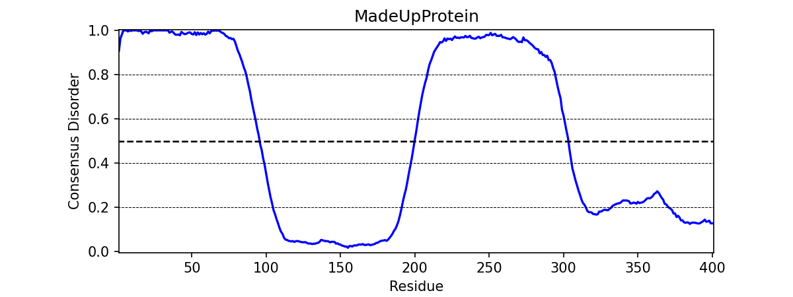

metapredict in Python
=====================

In addition to using metapredict from the command line, you can also use it directly in Python.

First import metapredict - 

.. code-block:: python

	import metapredict as meta

Once metapredict is imported, you can work with individual sequences or .fasta files. 

Predicting Disorder
--------------------

The ``predict_disorder()`` function will return a list of predicted disorder consensus values for the residues of the input sequence. The input sequence should be a string made of valid amino acids. Running -

.. code-block:: python
	
	meta.predict_disorder("DSSPEAPAEPPKDVPHDWLYSYVFLTHHPADFLR")

would output -

.. code-block:: python
	
	[1, 1, 1, 1, 0.957, 0.934, 0.964, 0.891, 0.863, 0.855, 0.793, 0.719, 0.665, 0.638, 0.576, 0.536, 0.496, 0.482, 0.306, 0.152, 0.096, 0.088, 0.049, 0.097, 0.235, 0.317, 0.341, 0.377, 0.388, 0.412, 0.46, 0.47, 0.545, 0.428]

**Additional Usage:**

**Disabling prediction value normalization -**
By default, output prediction values are normalized between 0 and 1. However, some of the raw values from the predictor are slightly less than 0 or slightly greater than 1. The negative values are simply replaced with 0 and the values greater than 1 are replaced with 1 by default. However, the user can get the raw prediction values by specifying *normalized=False* as a second argument in meta.predict_disorder. There is not a very good reason to do this, and it is generally not recommended. However, we wanted to give users the maximum amount of flexibility when using metapredict, so we made it an option.

.. code-block:: python
	
	meta.predict_disorder("DSSPEAPAEPPKDVPHDWLYSYVFLTHHPADFLR", normalized=False)

Predicting AlphaFold2 Confidence Scores
----------------------------------------

The ``predict_confidence`` function will return a list of predicted AlphaFold2 confidence scores  for each residue of the input sequence. The input sequence should be a string. Running -

.. code-block:: python
	
	meta.predict_confidence("DAPPTSQEHTQAEDKERD")

would output -

.. code-block:: python
	
	[35.7925, 40.4579, 46.3753, 46.2976, 42.3189, 42.0248, 43.5976, 40.7481, 40.1676, 41.9618, 43.3977, 43.938, 41.8352, 44.0462, 44.5382, 46.3081, 49.2345, 46.0671]

Graphing Disorder
------------------

The ``graph_disorder()`` function will show a plot of the predicted disorder consensus values across the input amino acid sequence. Running - 

.. code-block:: python
	
	meta.graph_disorder("GHPGKQRNPGEHHSSRNVKRNWNNSPSGPNEGRESQEERKTPPRRGGQQSGESHNQDETNKPNPSDNHHEEEKADDNAHRGNDSSPEAPAEPPKDVPHDWLYSYVFLTHHPADFLRAKRVLRENFVQCEKAWHRRRLAHPYNRINMQWLDVFDGDCWLAPQLCFGFQFGHDRPVWKIFWYHERGDLRYKLILKDHANVLNKPAHSRNARCESSAPSHDPHGNANSYDKKVTTPDPTEIKSSQESGNSNPDHSPHMPGRDMQEQPGEEPGGHPEKRLIRSKGKTDYKDNRSPRNNPSTDPEWESAHFQWSHDPNEQWLHNLGWPMRWMWQLPNPGIEPFSLNTRKKAPSWINLLYNADPCKTQDDERDCEHHMYQIQPIAPVPKIAMHYCTCFPRVHRIPC")

would output -

.. image:: ../images/meta_predict_disorder.png
  :width: 400

**Additional Usage**

**Adding Predicted AlphaFold2 Confidence Scores -**
To add predicted AlphaFold2 confidence scores, simply specify *confidence_scores=True*.

**Example**

.. code-block:: python
	
	seq = 'GHPGKQRNPGEHHSSRNVKRNWNNSPSGPNEGRESQEERKTPPRRGGQQSGESHNQDETNKPNPSDNHHEEEKADDNAHRGNDSSPEAPAEPPKDVPHDWLYSYVFLTHHPADFLRAKRVLRENFVQCEKAWHRRRLAHPYNRINMQWLDVFDGDCWLAPQLCFGFQFGHDRPVWKIFWYHERGDLRYKLILKDHANVLNKPAHSRNARCESSAPSHDPHGNANSYDKKVTTPDPTEIKSSQESGNSNPDHSPHMPGRDMQEQPGEEPGGHPEKRLIRSKGKTDYKDNRSPRNNPSTDPEWESAHFQWSHDPNEQWLHNLGWPMRWMWQLPNPGIEPFSLNTRKKAPSWINLLYNADPCKTQDDERDCEHHMYQIQPIAPVPKIAMHYCTCFPRVHRIPC'
	
	meta.graph_disorder(seq, confidence_scores=True)

would output - 

.. image:: ../images/confidence_scores_disorder.png
  :width: 400

**Changing title of generated graph -**
There are two parameters that the user can change for graph_disorder(). The first is the name of the title for the generated graph. The name by default is blank and the title of the graph is simply *Predicted protein disorder*. However, the title can be specified by specifing *title* = "my cool title" would result in a title of *my cool title*. Running - 

.. code-block:: python

	meta.graph_disorder("GHPGKQRNPGEHHSSRNVKRNWNNSPSGPNEGRESQEERKTPPRRGGQQSGESHNQDETNKPNPSDNHHEEEKADDNAHRGNDSSPEAPAEPPKDVPHDWLYSYVFLTHHPADFLRAKRVLRENFVQCEKAWHRRRLAHPYNRINMQWLDVFDGDCWLAPQLCFGFQFGHDRPVWKIFWYHERGDLRYKLILKDHANVLNKPAHSRNARCESSAPSHDPHGNANSYDKKVTTPDPTEIKSSQESGNSNPDHSPHMPGRDMQEQPGEEPGGHPEKRLIRSKGKTDYKDNRSPRNNPSTDPEWESAHFQWSHDPNEQWLHNLGWPMRWMWQLPNPGIEPFSLNTRKKAPSWINLLYNADPCKTQDDERDCEHHMYQIQPIAPVPKIAMHYCTCFPRVHRIPC", title = "MadeUpProtein")

would output -

**Changing the resolution of the generated graph -**
By default, the output graph has a DPI of 150. However, the user can change the DPI of the generated graph (higher values have greater resolution). To do so, simply specify *DPI=Number* where the number is an integer.

**Example:**

.. code-block:: python

	meta.graph_disorder("DAPPTSQEHTQAEDKERD", DPI=300)

**Changing the disorder threshold line -**
The disorder threshold line for graphs defaults to 0.3. However, if you want to change where the line designating the disorder cutoff is, simply specify *disorder_threshold = Float* where Float is some decimal value between 0 and 1.

**Example**

.. code-block:: python

	meta.graph_disorder("DAPPTSQEHTQAEDKERD", disorder_threshold=0.5)

**Adding shaded regions to the graph -** If you would like to shade specific regions of your generated graph (perhaps shade the disordered regions), you can specify *shaded_regions=[[list of regions]]* where the list of regions is a list of lists that defines the regions to shade.

**Example**

.. code-block:: python

    meta.graph_disorder("DAPPTSQEHTQAEDKERDDAPPTSQEHTQAEDKERDDAPPTSQEHTQAEDKERD", shaded_regions=[[1, 20], [30, 40]])

In addition, you can specify the color of the shaded regions by specifying *shaded_region_color*. The default for this is red. You can specify any matplotlib color or a hex color string.

**Example**

.. code-block:: python

    meta.graph_disorder("DAPPTSQEHTQAEDKERDDAPPTSQEHTQAEDKERDDAPPTSQEHTQAEDKERD", shaded_regions=[[1, 20], [30, 40]], shaded_region_color="blue")

**Saving the graph -** By default, the graph will automatically appear. However, you can also save the graph if you'd like. To do this, simply specify *output_file = path_where_to_save/filename.file_extension.* For example, output_file=/Users/thisUser/Desktop/cool_graphs/myCoolGraph.png. You can save the file with any valid matplotlib extension (.png, .pdf, etc.). 

**Example**

.. code-block:: python

    meta.graph_disorder("DAPPTSQEHTQAEDKER", output_file=/Users/thisUser/Desktop/cool_graphs/myCoolGraph.png)

Graphing AlphaFold2 Confidence Scores
--------------------------------------

The ``graph_confidence`` function will show a plot of the predicted AlphaFold2 confidence scores across the input amino acid sequence.

**Example**

.. code-block:: python

    meta.graph_confidence("DAPTSQEHTQAEDKERDSKTHPQKKQSPS")

This function has all of the same functionality as ``graph_disorder``.

Calculating Percent Disorder:
-----------------------------

The ``percent_disorder()`` function will return the percent of residues in a sequence that have predicted consensus disorder values of 0.3 or more. Running -

.. code-block:: python

	meta.percent_disorder("DSSPEAPAEPPKDVPHDWLYSYVFLTHHPADFLR")

would output - 

.. code-block:: python

	82.39999

By default, this uses a cutoff predicted value of equal to or greater than 0.3 for a residue to be considered disordered.

**Additional Usage:**

**Changing the cutoff value -**
If you want to be more strict in what you consider to be disordered for calculating percent disorder of an input sequence, you can simply specify the cutoff value by adding the argument *cutoff=decimal* where the decimal corresponds to the percent you would like to use as the cutoff (for example, 0.8 would be 80%).

**Example:**

.. code-block:: python

	meta.percent_disorder("DSSPEAPAEPPKDVPHDWLYSYVFLTHHPADFLR", cutoff = 0.8)

would output

.. code-block:: python

	29.4

The higher the cutoff value, the higher the value any given predicted residue must be greater than or equal to in order to be considered disordered when calculating the final percent disorder for the input sequence.

Predicting Disorder From a .fasta File:
---------------------------------------

By using the ``predict_disorder_fasta()`` function, you can predict disorder values for the amino acid sequences in a .fasta file. By default, this function will return a dictionary where the keys in the dictionary are the fasta headers and the values are the consensus disorder predictions of the amino acid sequence associated with each fasta header in the original .fasta file.

**Example:**

.. code-block:: python

	meta.predict_disorder_fasta("file path to .fasta file/fileName.fasta")

An actual filepath would look something like:

.. code-block:: python

	meta.predict_disorder_fasta("/Users/thisUser/Desktop/coolSequences.fasta")

**Additional Usage:**

**Save the output values -**
By default the predict_disorder_fasta function will immediately return a dictionary. However, you can also save the output to a .csv file by specifying *output_file = "location you want to save the file to*". When specifying the file path, you also want to specify the file name. The first cell of each row will contain a fasta header and the subsequent cells in that row will contain predicted consensus disorder values for the protein associated with the fasta header.

**Example:**

.. code-block:: python

    meta.predict_disorder_fasta("file path to .fasta file/fileName.fasta", output_file="file path where the output .csv should be saved")

An actual filepath would look something like:

.. code-block:: python

    meta.predict_disorder_fasta("/Users/thisUser/Desktop/coolSequences.fasta", output_file="/Users/thisUser/Desktop/cool_predictions.csv")

**Get raw prediction values -**
By default, this function will output prediction values that are normalized between 0 and 1. However, some of the raw values from the predictor are slightly less than 0 or slightly greater than 1. The negative values are simply replaced with 0 and the values greater than 1 are replaced with 1 by default. If you want the raw values simply specify *normalized=False*. There is not a very good reason to do this, and it is generally not recommended. However, we wanted to give users the maximum amount of flexibility when using metapredict, so we made it an option.

**Example:**

.. code-block:: python

	meta.predict_disorder_fasta("/Users/thisUser/Desktop/coolSequences.fasta", normalized=False)

Predicting AlphaFold2 confidence scores From a .fasta File
-------------------------------------------------------------

Just like with ``predict_disorder_fasta``, you can use ``predict_confidence_fasta`` to get predicted AlphaFold2 confidence scores from a fasta file. All the same functionality in ``predict_disorder_fasta`` is in ``predict_confidence_fasta``.

**Example**

.. code-block:: python

	meta.predict_confidence_fasta("/Users/thisUser/Desktop/coolSequences.fasta")

Predict Disorder Using Uniprot ID
-----------------------------------

By using the ``predict_disorder_uniprot()`` function, you can return predicted consensus disorder values for the amino acid sequence of a protein by specifying the Uniprot ID. 

**Example**

.. code-block:: python

    meta.predict_disorder_uniprot("Q8N6T3")

Predicting AlphaFold2 Confidence Scores Using Uniprot ID
-----------------------------------------------------------

By using the ``predict_confidence_uniprot`` function, you can generate predicted AlphaFold2 confidence scores by inputting a Uniprot ID.

**Example**

.. code-block:: python

    meta.predict_confidence_uniprot('P16892')

Generating Disorder Graphs From a .fasta File:
-----------------------------------------------

By using the ``graph_disorder_fasta()`` function, you can graph predicted consensus disorder values for the amino acid sequences in a .fasta file. The *graph_disorder_fasta* function takes a .fasta file as input and by default will return the graphs immediately. However, you can specify *output_dir=path_to_save_files* which result in a .png file saved to that directory for every sequence within the .fasta file. You cannot specify the output file name here! By default, the file name will be the first 14 characters of the FASTA header followed by the filetype as specified by filetype. If you wish for the files to include a unique leading number (i.e. X_rest_of_name where X starts at 1 and increments) then set *indexed_filenames = True*. This can be useful if you have sequences where the 1st 14 characters may be identical, which would otherwise overwrite an output file. By default this will return a single graph for every sequence in the FASTA file. 

**WARNING -**
This command will generate a graph for ***every*** sequence in the .fasta file. If you have 1,000 sequences in a .fasta file and you do not specify the *output_dir*, it will generate **1,000** graphs that you will have to close sequentially. Therefore, I recommend specifying the *output_dir* such that the output is saved to a dedicated folder.

**Example:**

.. code-block:: python

    meta.graph_disorder_fasta("file path to .fasta file/fileName.fasta", output_dir="file path of where to save output graphs")

An actual filepath would look something like:

.. code-block:: python

    meta.graph_disorder_fasta("/Users/thisUser/Desktop/coolSequences.fasta", output_dir="/Users/thisUser/Desktop/folderForGraphs")

**Additional Usage**

**Adding Predicted AlphaFold2 Confidence Scores -**
To add predicted AlphaFold2 confidence scores, simply specify *confidence_scores=True*.

**Example**

.. code-block:: python

    meta.graph_disorder_fasta("/Users/thisUser/Desktop/coolSequences.fasta", confidence_scores=True)

**Changing resolution of saved graphs -**
By default, the output files have a DPI of 150. However, the user can change the DPI of the output files (higher values have greater resolution but take up more space). To change the DPI, specify *DPI=Number* where Number is an integer.

**Example:**

.. code-block:: python

	meta.graph_disorder_fasta("/Users/thisUser/Desktop/coolSequences.fasta", DPI=300, output_dir="/Users/thisUser/Desktop/folderForGraphs")

**Changing the output File Type -** 
By default ths output file is a .png. However, you can specify the output file type by using *output_filetype="file_type"* where file_type is some matplotlib compatible file type (such as .pdf).

**Example**

.. code-block:: python

    meta.graph_disorder_fasta("/Users/thisUser/Desktop/coolSequences.fasta", output_dir="/Users/thisUser/Desktop/folderForGraphs", output_filetype = "pdf")

**Indexing generated files -**
If you would like to index the file names with a leading unique integer starting at 1, set *indexed_filenames=True*.

**Example**

.. code-block:: python

    meta.graph_disorder_fasta("/Users/thisUser/Desktop/coolSequences.fasta", output_dir="/Users/thisUser/Desktop/folderForGraphs", indexed_filenames=True)

Generating AlphaFold2 Confidence Score Graphs from fasta files
----------------------------------------------------------------

By using the ``graph_confidence_fasta`` function, you can graph predicted AlphaFold2 confidence scores for the amino acid sequences in a .fasta file. This works the same as ``graph_disorder_fasta`` but instead returns graphs with just the predicted AlphaFold2 confidence scores.

.. code-block:: python

    meta.graph_confidence_fasta("/Users/thisUser/Desktop/coolSequences.fasta", output_dir="/Users/thisUser/Desktop/folderForGraphs")

Generating Graphs Using Uniprot ID
------------------------------------

By using the ``graph_disorder_uniprot()`` function, you can graph predicted consensus disorder values for the amino acid sequence of a protein by specifying the Uniprot ID. 

**Example**

.. code-block:: python

    meta.graph_disorder_uniprot("Q8N6T3")

This function carries all of the same functionality as ``graph_disorder()`` including specifying disorder_threshold, title of the graph, the DPI, and whether or not to save the output.

**Example**

.. code-block:: python

    meta.graph_disorder_uniprot("Q8N6T3", disorder_threshold=0.5, title="my protein", DPI=300, output_file="/Users/thisUser/Desktop/my_cool_graph.png")

**Additional usage**

**Adding Predicted AlphaFold2 Confidence Scores -**
To add predicted AlphaFold2 confidence scores, simply specify *confidence_scores=True*.

**Example**

.. code-block:: python

    meta.graph_disorder_uniprot("Q8N6T3", confidence_scores=True)

Generating AlphaFold2 Confidnce Score Graphs Using Uniprot ID
--------------------------------------------------------------

Just like with disorder predictions, you can also get AlphaFold2 confidence score graphs using the Uniprot ID. This will **only display the confidence scores** and not the predicted disorder scores. 

**Example**

.. code-block:: python

    meta.graph_confidence_uniprot("Q8N6T3")

Predicting Disorder Domains:
-----------------------------

The ``predict_disorder_domains()`` function takes in an amino acid function and returns a 4-position tuple with: 0. the raw disorder scores from 0 to 1 where 1 is the highest probability that a residue is disordered, 1. the smoothed disorder score used for boundary identification, 2. a list of elements where each element is a list where 0 and 1 define the IDR location and 2 gives the actual sequence, and 3. a list of elements where each element is a list where 0 and 1 define the folded domain location and 2 gives the actual sequence

.. code-block:: python

	meta.predict_disorder_domains("MKAPSNGFLPSSNEGEKKPINSQLWHACAGPLVSLPPVGSLVVYFPQGHSEQVAASMQKQTDFIPNYPNLPSKLICLLHS")

would output - 

.. code-block:: python

	[[0.828, 0.891, 0.885, 0.859, 0.815, 0.795, 0.773, 0.677, 0.66, 0.736, 0.733, 0.708, 0.66, 0.631, 0.601, 0.564, 0.532, 0.508, 0.495, 0.458, 0.383, 0.373, 0.398, 0.36, 0.205, 0.158, 0.135, 0.091, 0.09, 0.102, 0.126, 0.129, 0.114, 0.106, 0.097, 0.085, 0.099, 0.114, 0.093, 0.119, 0.117, 0.043, 0.015, 0.05, 0.139, 0.172, 0.144, 0.121, 0.124, 0.128, 0.147, 0.173, 0.129, 0.152, 0.169, 0.2, 0.172, 0.22, 0.216, 0.25, 0.272, 0.308, 0.248, 0.255, 0.301, 0.274, 0.264, 0.28, 0.25, 0.235, 0.221, 0.211, 0.235, 0.185, 0.14, 0.168, 0.307, 0.509, 0.544, 0.402], array([0.87596856, 0.86139124, 0.84596224, 0.82968293, 0.81255466,
       0.79457882, 0.77575677, 0.75608988, 0.73557951, 0.71422703,
       0.69203382, 0.66900124, 0.63956894, 0.62124099, 0.60188696,
       0.57893168, 0.55241615, 0.52131925, 0.4859528 , 0.44109689,
       0.39353789, 0.35264348, 0.31495776, 0.28      , 0.24661615,
       0.21469814, 0.18500621, 0.15963478, 0.13604845, 0.1172087 ,
       0.10798882, 0.1026882 , 0.09419503, 0.08462484, 0.08256398,
       0.08832671, 0.0908559 , 0.09263851, 0.09438758, 0.09309938,
       0.09102733, 0.09338137, 0.09665342, 0.10073913, 0.10392671,
       0.11010311, 0.11402981, 0.11898634, 0.12430683, 0.13169441,
       0.1381764 , 0.15245093, 0.16746957, 0.17518385, 0.18167578,
       0.18893043, 0.20013416, 0.21581491, 0.23015652, 0.2420559 ,
       0.25209814, 0.25817391, 0.26588944, 0.27456894, 0.27429068,
       0.26411925, 0.24452671, 0.23076894, 0.22834783, 0.21689842,
       0.20887549, 0.20564427, 0.20856996, 0.21901779, 0.23835296,
       0.26794071, 0.30914625, 0.36333478, 0.43187154, 0.51612174]), [[0, 20, 'MKAPSNGFLPSSNEGEKKPI']], [[20, 80, 'NSQLWHACAGPLVSLPPVGSLVVYFPQGHSEQVAASMQKQTDFIPNYPNLPSKLICLLHS']]]

**Additional Usage**

**Altering the disorder theshhold -**
To alter the disorder theshold, simply set *disorder_threshold=my_value* where *my_value* is a float. The higher the treshold value, the more conservative metapredict will be for designating a region as disordered. Default = 0.42

**Example**

.. code-block:: python

	meta.predict_disorder_domains("MKAPSNGFLPSSNEGEKKPINSQLWHACAGPLV", disorder_threshold=0.3)

**Altering minimum IDR size -**
The minimum IDR size will define the smallest possible region that could be considered an IDR. In other words, you will not be able to get back an IDR smaller than the defined size. Default is 12.

**Example**

.. code-block:: python

	meta.predict_disorder_domains("MKAPSNGFLPSSNEGEKKPINSQLWHACAGPLV", minimum_IDR_size = 10)

**Altering the minimum folded domain size -**
The minimum folded domain size defines where we expect the limit of small folded domains to be. *NOTE* this is not a hard limit and functions more to modulate the removal of large gaps. In other words, gaps less than this size are treated less strictly. *Note* that, in addition, gaps < 35 are evaluated with a threshold of 0.35 x disorder_threshold and gaps < 20 are evaluated with a threshold of 0.25 x disorder_threshold. These two lengthscales were decided based on the fact that coiled-coiled regions (which are IDRs in isolation) often show up with reduced apparent disorder within IDRs but can be as short as 20-30 residues. The folded_domain_threshold is used based on the idea that it allows a 'shortest reasonable' folded domain to be identified. Default=50.

**Example**

.. code-block:: python

	meta.predict_disorder_domains("MKAPSNGFLPSSNEGEKKPINSQLWHACAGPLV", minimum_folded_domain = 60)

**Altering gap_closure -**
The gap closure defines the largest gap that would be closed. Gaps here refer to a scenario in which you have two groups of disordered residues seprated by a 'gap' of not disordered residues. In general large gap sizes will favour larger contiguous IDRs. It's worth noting that gap_closure becomes relevant only when minimum_region_size becomes very small (i.e. < 5) because really gaps emerge when the smoothed disorder fit is "noisy", but when smoothed gaps are increasingly rare. Default=10.

**Example**

.. code-block:: python

	meta.predict_disorder_domains("MKAPSNGFLPSSNEGEKKPINSQLWHACAGPLV", gap_closure = 5)

Predicting Disorder Domains using a Uniprot ID:
-------------------------------------------------

In addition to inputting a sequence, you can predict disorder domains by inputting a Uniprot ID by using the ``predict_disorder_domains_uniprot`` function. This function has the exact same functionality as ``predict_disorder_domains`` except you can now input a Uniprot ID. 

**Example**

.. code-block:: python

    meta.predict_disorder_domains_uniprot('Q8N6T3')

