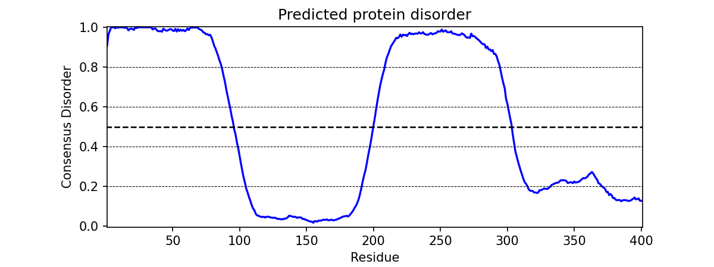

**********************
metapredict in Python
**********************

In addition to using metapredict from the command line, you can also use it directly in Python. This enables metapredict to be incorporated into your bioinformatic workflows with ease

First import metapredict:

.. code-block:: python

	import metapredict as meta

Once metapredict is imported, you can work with individual sequences or .fasta files. :doc:`For a list of all metapredict's public-facing functions and their documentation click here  <api>`

Important updates
====================

Update to metapredict V3 (November 2024)
~~~~~~~~~~~~~~~~~~~~~~~~~~~~~~~~~~~~~~~~~~~

In November 2024 we upated the default version of metapredict updated to be V3. V3 introduces a few new changes including increased speed for all disorder and pLDDT predictions on CPU or GPU **and new networks for pLDDT and disorder prediction**. The new default network for disorder prediction is V3. The new default network for pLDDT prediction is V2. Furthermore, V3 introduces simplification to our Python functionality in that :code:`predict_disorder()` now offers functionality for individual predictions and batch predictions for all metapredict networks. In addition, the same functionality now applies to :code:`predict_pLDDT()`, enabling massive increases in pLDDT prediction. 
		
If a CUDA-enabled GPU is available, batch prediction will automatically use it. If not, batch prediction will fallback to CPU. While all the original functionality is preserved, :code:`predict_disorder()`, offers a 5-10x speedup on CPUs and 30-40x speedup on GPUs. In addition, Apple Silicon machines can now use the MPS framework for GPU predictions. 

:code:`predict_disorder()` can **as of v3** take in a single sequence, a list of sequences or a dictionary of sequences, and returns individual scores, a list or dictionary that maps input index back to a two-position list of sequence and disorder scores or, if :code:`return_disorder_domains` is set to True, metapredict will return :code:`DisorderDomain` objects.

This functionality is described in detail in the function documentation under the Python Module Documentation entry for :code:`predict_disorder()`.

Note - all functionanlity previously only in :code:`predict_disorder_batch()` is now in :code:`predict_disorder_() for disorder prediction and :code:`predict_pLDDT for pLDDT score prediction. However, for V3 we decided to maintain backwards compaibility with V2 so the :code:`predict_disorder_batch()` still works, it's just not necessary. We plan to deprecate this functionality in the future as it is now redundant.

Predicting Disorder
====================

The ``predict_disorder()`` function can take in an individual sequence as a string, a list of sequences, or a dictionary of sequences where the key for each sequence is the name of that sequence and the value in the dictionary is the corresponding sequence. Depending on your input, metapredict will return **for single sequences:** a list of predicted disorder consensus values for the residues of the input sequence, **for a list of sequences:** a nested list where the first value in each sublist is the sequence and the second value in each sublist is a list or numpy array of disorder values, and **for a dictionary of sequences:** a dictionary where the key is the name of the sequence and the value is a list where the first element in the list is the sequence and the second value in the list is a list or numpy array of disorder values. 

Example of usage:
^^^^^^^^^^^^^^^^^^

**Predicting disorder for a single sequence**  
  
.. code-block:: python
	
	meta.predict_disorder("DSSPEAPAEPPKDVPHDWLYSYVFLTHHPADFLR")

would output -

.. code-block:: python
	
	array([0.8173, 0.8311, 0.8276, 0.8193, 0.8036, 0.7832, 0.7485, 0.708 ,
       0.6778, 0.64  , 0.5948, 0.5439, 0.5062, 0.47  , 0.448 , 0.4356,
       0.412 , 0.3687, 0.3294, 0.2986, 0.2724, 0.2543, 0.238 , 0.227 ,
       0.2185, 0.2084, 0.1846, 0.1665, 0.1559, 0.1373, 0.124 , 0.1133,
       0.0958, 0.0738], dtype=float32)

**Predicting disorder for a list of sequences**  
  
.. code-block:: python

	sequences=['GSGSGSGSSGSGSGS', 'DSSPEAPAEPPKDVPHDWLYSYVFLTHHPADFLR']
	meta.predict_disorder(sequences)

would output -

.. code-block:: python
	
	[['GSGSGSGSSGSGSGS', array([0.8916, 0.9393, 0.9505, 0.9596, 0.9618, 0.9639, 0.9623, 0.9589,
       0.9517, 0.9371, 0.917 , 0.8955, 0.8827, 0.8773, 0.8686],
      dtype=float32)], ['DSSPEAPAEPPKDVPHDWLYSYVFLTHHPADFLR', array([0.8173, 0.8311, 0.8276, 0.8193, 0.8036, 0.7832, 0.7485, 0.708 ,
       0.6778, 0.64  , 0.5948, 0.5439, 0.5062, 0.47  , 0.448 , 0.4356,
       0.412 , 0.3687, 0.3294, 0.2986, 0.2724, 0.2543, 0.238 , 0.227 ,
       0.2185, 0.2084, 0.1846, 0.1665, 0.1559, 0.1373, 0.124 , 0.1133,
       0.0958, 0.0738], dtype=float32)]]

**Predicting dictionaries of sequences**  

.. code-block:: python

	sequences={'seq1':'GSGSGSGSSGSGSGS', 'seq2':'DSSPEAPAEPPKDVPHDWLYSYVFLTHHPADFLR'}
	meta.predict_disorder(sequences)

would output -

.. code-block:: python
	
	{'seq1': ['GSGSGSGSSGSGSGS', array([0.8916, 0.9393, 0.9505, 0.9596, 0.9618, 0.9639, 0.9623, 0.9589,
       0.9517, 0.9371, 0.917 , 0.8955, 0.8827, 0.8773, 0.8686],
      dtype=float32)], 'seq2': ['DSSPEAPAEPPKDVPHDWLYSYVFLTHHPADFLR', array([0.8173, 0.8311, 0.8276, 0.8193, 0.8036, 0.7832, 0.7485, 0.708 ,
       0.6778, 0.64  , 0.5948, 0.5439, 0.5062, 0.47  , 0.448 , 0.4356,
       0.412 , 0.3687, 0.3294, 0.2986, 0.2724, 0.2543, 0.238 , 0.227 ,
       0.2185, 0.2084, 0.1846, 0.1665, 0.1559, 0.1373, 0.124 , 0.1133,
       0.0958, 0.0738], dtype=float32)]}

Additional Usage:
~~~~~~~~~~~~~~~~~~~

Disabling prediction value normalization
------------------------------------------
By default, output prediction values are normalized between 0 and 1. However, some of the raw values from the predictor are slightly less than 0 or slightly greater than 1. The negative values are simply replaced with 0 and the values greater than 1 are replaced with 1 by default. However, you can disable this by setting ``normalized=False`` as a second argument in ``meta.predict_disorder()``. There is not a very good reason to do this, and it is generally not recommended. 

.. code-block:: python
	
	meta.predict_disorder("DSSPEAPAEPPKDVPHDWLYSYVFLTHHPADFLR", normalized=False)

Using the different versions of the metapredict network
------------------------------------------------------------
V3 is the default metapredict network for disorder prediction. To use the original metapredict network (previously referred to as 'legacy', simply set ``version=1``. 

**Example:** 

.. code-block:: python
    
    meta.predict_disorder("DSSPEAPAEPPKDVPHDWLYSYVFLTHHPADFLR", version=1)

To use the V2 metapredict network, simply set ``version=2``.

**Example:** 

.. code-block:: python
    
    meta.predict_disorder("DSSPEAPAEPPKDVPHDWLYSYVFLTHHPADFLR", version=2)

Selecting a specific device to use for predictions
------------------------------------------------------
If you are predicting a single IDR, metapredict will just use the CPU. However, if you input a list or dictionary of sequences, metapredict will see if a CUDA-enabled GPU is available to use and *if one is available*, metapredict will use that GPU to increase the speed of disorder prediction. However, you can 'force' metapredict to use one or the other if you'd like. You can also specify a GPU if you have multiple available. In addition, if you are using MacOS and an Apple Silicon computer, you can use a Mac GPU using the MPS framework. Metapredict will not do this automatically because mps is still under development.

**Example - predicting on CPU:** 

.. code-block:: python

    sequences=['GSGSGSGSSGSGSGS', 'DSSPEAPAEPPKDVPHDWLYSYVFLTHHPADFLR']
    meta.predict_disorder(sequences, device='cpu')

**Example - predicting on CUDA-enabled GPU:** 

.. code-block:: python

    sequences=['GSGSGSGSSGSGSGS', 'DSSPEAPAEPPKDVPHDWLYSYVFLTHHPADFLR']
    meta.predict_disorder(sequences, device='cuda')

**Example - predicting on first CUDA-enabled GPU:** 

.. code-block:: python

    sequences=['GSGSGSGSSGSGSGS', 'DSSPEAPAEPPKDVPHDWLYSYVFLTHHPADFLR']
    meta.predict_disorder(sequences, device=0)

**Example - predicting on MacOS GPU (MPS):** 

.. code-block:: python

    sequences=['GSGSGSGSSGSGSGS', 'DSSPEAPAEPPKDVPHDWLYSYVFLTHHPADFLR']
    meta.predict_disorder(sequences, device='mps')

Returning a list instead of a np.array
---------------------------------------------
By default, metapredict will return a numpy array of predicted disorder values. However, if you would like to return a list instead, you can specify ``return_numpy=False``.

**Example - returning a list:** 

.. code-block:: python

    sequences=['GSGSGSGSSGSGSGS', 'DSSPEAPAEPPKDVPHDWLYSYVFLTHHPADFLR']
    meta.predict_disorder(sequences, return_numpy=False)

Predicting disorder domains
---------------------------------------------
You previously had to use the ``predict_disorder_domains()`` function to get a DisorderObject returned. Now you can just use ``predict_disorder()`` and set ``return_domains=True``.

The DisorderObject has 6 dot variables that can be called to get information about your input sequence. They are as follows:

.sequence : str    
    Amino acid sequence 

.disorder : list or np.ndaarray
    Hybrid disorder score

.disordered_domain_boundaries : list
    List of domain boundaries for IDRs using Python indexing

.folded_domain_boundaries : list
    List of domain boundaries for folded domains using Python indexing

.disordered_domains : list
    List of the actual sequences for IDRs

.folded_domains : list
    List of the actual sequences for folded domains

**Example - predicting disorder domains:** 

.. code-block:: python

    sequences=['GSGSGSGSSGSGSGS', 'DSSPEAPAEPPKDVPHDWLYSYVFLTHHPADFLR']
    meta.predict_disorder(sequences, return_domains=True)

For DisorderObjects, you can also specify the ``disorder_threshold`` (default is the default value for your chosen network), ``minimum_IDR_size`` (default=12), ``minimum_folded_domain`` (default=50), ``gap_closure`` (default=10), and ``override_folded_domain_minsuze`` (default=False). 

 * ``minimum_IDR_size``: The shortest length of a possible IDR.
 * ``minimum_folded_domain``: The shortest length of a possible folded domain. This is NOT a hard limit and functions to modulate the removal of large gaps (i.e. gaps less than this size are treated less strictly).
 * ``gap_closure``: The largest gap that would be closed. Gaps here refer to a scenario in which you have two groups of disordered residues separated by a 'gap' of not disordered residues. In general large gap sizes will favor larger contiguous IDRs. 
 * ``override_folded_domain_minsize``: If you want to override the default minimum folded domain size, you can set this to a value. Basically a failsafe check that assumes folded domains shouldn't be less than 35 or 20 residues. 
 * ``disorder_threshold``: The disorder threshold for the prediction. The higher the threshold value, the more conservative metapredict will be for designating a region as disordered. 

**Additional options when using predict_disorder() -**
Additional options whenusing ``predict_disorder()`` are:
 * ``print_performance``: If you want to see the performance of the prediction, you can set this to True. 
 * ``show_progress_bar``: If you want to see the progress of the predictions, you can set this to True. This will make a progress bar appear when doing predictions. 
 * ``force_disable_batch``: Allows you to disable batch predictions. This is mainly for debugging. 
 * ``disable_pack_n_pad``: Allows disabling of the packing and padding of sequences. This is mainly for debugging. 
 * ``silence_warnings``: If you want to silence warnings, you can set this to True. 
 * ``legacy``: if you want to use legacy metapredict, you can set ``legacy=True`` instead of specifying ``version``. This is primarily for backwards compatibility. 

Predicting AlphaFold2 Confidence Scores
========================================

The ``predict_pLDDT()`` function now works similar to the ``predict_disorder()`` function. It can now take in an individual sequence as a string, a list of sequences, or a dictionary of sequences where the key for each sequence is the name of that sequence and value in the dictionary is the corresponding sequence. Depending on your input, metapredict will return **for single sequences:** a list of predicted pLDDT scores for the residues of the input sequence, **for a list of sequences:** a nested list where the first value in each sublist is the sequence and the second value in each sublist is a list or numpy array of pLDDT scores, and **for a dictionary of sequences:** a dictionary where the key is the name of the sequence and the value is a list where the first element in the list is the sequence and the second value in the list is a list or numpy array of pLDDT scores. 

Example of usage:
^^^^^^^^^^^^^^^^^^
**Single sequence predictions using meta.predict_pLDDT()**  
  
Running -

.. code-block:: python
	
	meta.predict_pLDDT("DSSPEAPAEPPKDVPHDWLYSYVFLTHHPADFLR")

would output -

.. code-block:: python
	
	array([28.6362, 28.5554, 28.2763, 33.8679, 32.6974, 33.338 , 39.2978,
       37.1473, 39.7755, 46.9065, 50.3769, 49.509 , 55.191 , 53.0317,
       57.9838, 56.5801, 60.6751, 59.5257, 64.2864, 67.5473, 69.8021,
       70.2081, 72.7588, 75.1032, 76.5738, 77.5005, 77.7688, 78.1601,
       79.7701, 80.8347, 80.2206, 85.2205, 88.1094, 92.1518],
      dtype=float32)

**Predicting lists of sequences using meta.predict_pLDDT()**  
  
Running -

.. code-block:: python

	sequences=['GSGSGSGSSGSGSGS', 'DSSPEAPAEPPKDVPHDWLYSYVFLTHHPADFLR']
	meta.predict_pLDDT(sequences)

would output -

.. code-block:: python
	
	[['GSGSGSGSSGSGSGS', array([22.5567, 22.9878, 23.96  , 23.4159, 24.7142, 24.7988, 26.3124,
       27.5982, 29.0002, 31.5604, 33.7347, 38.4765, 43.2199, 49.3181,
       56.6075], dtype=float32)], ['DSSPEAPAEPPKDVPHDWLYSYVFLTHHPADFLR', array([28.6362, 28.5554, 28.2763, 33.8679, 32.6974, 33.338 , 39.2978,
       37.1473, 39.7755, 46.9065, 50.3769, 49.509 , 55.191 , 53.0317,
       57.9838, 56.5801, 60.6751, 59.5257, 64.2864, 67.5473, 69.8021,
       70.2081, 72.7588, 75.1032, 76.5738, 77.5005, 77.7688, 78.1601,
       79.7701, 80.8347, 80.2206, 85.2205, 88.1094, 92.1518],
      dtype=float32)]]

**Predicting dictionaries of sequences using meta.predict_pLDDt()**  
  
Running -

.. code-block:: python

	sequences={'seq1':'GSGSGSGSSGSGSGS', 'seq2':'DSSPEAPAEPPKDVPHDWLYSYVFLTHHPADFLR'}
	meta.predict_pLDDT(sequences)

would output -

.. code-block:: python
	
	{'seq1': ['GSGSGSGSSGSGSGS', array([22.5567, 22.9878, 23.96  , 23.4159, 24.7142, 24.7988, 26.3124,
       27.5982, 29.0002, 31.5604, 33.7347, 38.4765, 43.2199, 49.3181,
       56.6075], dtype=float32)], 'seq2': ['DSSPEAPAEPPKDVPHDWLYSYVFLTHHPADFLR', array([28.6362, 28.5554, 28.2763, 33.8679, 32.6974, 33.338 , 39.2978,
       37.1473, 39.7755, 46.9065, 50.3769, 49.509 , 55.191 , 53.0317,
       57.9838, 56.5801, 60.6751, 59.5257, 64.2864, 67.5473, 69.8021,
       70.2081, 72.7588, 75.1032, 76.5738, 77.5005, 77.7688, 78.1601,
       79.7701, 80.8347, 80.2206, 85.2205, 88.1094, 92.1518],
      dtype=float32)]}

Additional Usage:
~~~~~~~~~~~~~~~~~~~

Disabling prediction value normalization
------------------------------------------
By default, output prediction values are normalized between 0 and 1. You can remove normalization by specifying ``normalized=False`` as a second argument in meta.predict_pLDDT(). 

.. code-block:: python
	
	meta.predict_pLDDT("DSSPEAPAEPPKDVPHDWLYSYVFLTHHPADFLR", normalized=False)

Using the different versions of the metapredict pLDDT network
---------------------------------------------------------------
V2 is the default metapredict network for pLDDT prediction. To use the original pLDDT prediction network (previously referred to as 'alphaPredict'), simply set ``pLDDT_version=1``.

**Example:** 

.. code-block:: python
    
    meta.predict_pLDDT("DSSPEAPAEPPKDVPHDWLYSYVFLTHHPADFLR", pLDDT_version=1)

Selecting a specific device to use for predictions
------------------------------------------------------
If you are predicting a single pLDDT score, metapredict will just use the CPU. However, if you input a list or dictionary of sequences, metapredict will see if a CUDA-enabled GPU is available to use and *if one is available*, metapredict will use that GPU to increase the speed of pLDDT prediction. However, you can 'force' metapredict to use one or the other if you'd like. You can also specify a GPU if you have multiple available. In addition, if you are using MacOS and an Apple Silicon computer, you can use a Mac GPU using the MPS framework. Metapredict will not do this automatically because mps is still under development.

**Example - predicting pLDDT scores on CPU:** 

.. code-block:: python

    sequences=['GSGSGSGSSGSGSGS', 'DSSPEAPAEPPKDVPHDWLYSYVFLTHHPADFLR']
    meta.predict_pLDDT(sequences, device='cpu')

**Example - predicting on CUDA-enabled GPU:** 

.. code-block:: python

    sequences=['GSGSGSGSSGSGSGS', 'DSSPEAPAEPPKDVPHDWLYSYVFLTHHPADFLR']
    meta.predict_pLDDT(sequences, device='cuda')

**Example - predicting on first CUDA-enabled GPU:** 

.. code-block:: python

    sequences=['GSGSGSGSSGSGSGS', 'DSSPEAPAEPPKDVPHDWLYSYVFLTHHPADFLR']
    meta.predict_pLDDT(sequences, device=0)

**Example - predicting on MacOS GPU (MPS):** 

.. code-block:: python

    sequences=['GSGSGSGSSGSGSGS', 'DSSPEAPAEPPKDVPHDWLYSYVFLTHHPADFLR']
    meta.predict_pLDDT(sequences, device='mps')

Returning a list instead of a np.array
---------------------------------------------
By default, metapredict will return a numpy array of predicted disorder values. However, if you would like to return a list instead, you can specify ``return_numpy=False``.

**Example - returning a list:** 

.. code-block:: python

    sequences=['GSGSGSGSSGSGSGS', 'DSSPEAPAEPPKDVPHDWLYSYVFLTHHPADFLR']
    meta.predict_pLDDT(sequences, return_numpy=False)

Predicting Disorder Domains:
=============================

The ``predict_disorder_domains()`` function takes in an amino acid sequence and returns a DisorderObject. The DisorderObject has 6 dot variables that can be called to get information about your input sequence. They are as follows:

.sequence : str    
    Amino acid sequence 

.disorder : list or np.ndaarray
    Hybrid disorder score

.disordered_domain_boundaries : list
    List of domain boundaries for IDRs using Python indexing

.folded_domain_boundaries : list
    List of domain boundaries for folded domains using Python indexing

.disordered_domains : list
    List of the actual sequences for IDRs

.folded_domains : list
    List of the actual sequences for folded domains

Example of usage:
^^^^^^^^^^^^^^^^^^

.. code-block:: python

	seq = meta.predict_disorder_domains("MKAPSNGFLPSSNEGEKKPINSQLWHACAGPLVSLPPVGSLVVYFPQGHSEQVAASMQKQTDFIPNYPNLPSKLICLLHS")

Now we can call the various dot values for **seq**. 

**Getting the sequence**

.. code-block:: python

	print(seq.sequence)

returns

.. code-block:: python

	MKAPSNGFLPSSNEGEKKPINSQLWHACAGPLVSLPPVGSLVVYFPQGHSEQVAASMQKQTDFIPNYPNLPSKLICLLHS

**Getting the disorder scores**

.. code-block:: python

	print(seq.disorder)

returns

.. code-block:: python

	[0.922  0.9223 0.9246 0.9047 0.8916 0.8956 0.8931 0.883  0.8613 0.8573
 	0.852  0.8582 0.8614 0.8455 0.826  0.7974 0.7616 0.7248 0.6782 0.6375
 	0.5886 0.5476 0.5094 0.4774 0.4472 0.4318 0.4266 0.4222 0.3953 0.3993
 	0.3904 0.4004 0.3962 0.3721 0.3855 0.3582 0.3456 0.3682 0.3488 0.3274
 	0.3258 0.2937 0.2864 0.3004 0.3358 0.3815 0.4397 0.4594 0.4673 0.4535
 	0.4446 0.4481 0.4546 0.4454 0.4549 0.4564 0.4677 0.4539 0.4713 0.49
 	0.4934 0.4835 0.4815 0.4692 0.4548 0.4856 0.495  0.4809 0.502  0.4944
 	0.4612 0.4561 0.436  0.4203 0.3784 0.3624 0.3739 0.3983 0.4348 0.4369]

**Getting the disorder domain boundaries**

.. code-block:: python

	print(seq.disordered_domain_boundaries)

returns

.. code-block:: python

	[[0, 23]]

Where each nested list is the boundaries for a specific disordered region and the first element in each list is the start of that region and the second element is the end of that region.

**Getting the folded domain boundaries**

.. code-block:: python

	print(seq.folded_domain_boundaries)

returns

.. code-block:: python

	[[23, 80]]

Where each nested list is the boundaries for a specific folded region and the first element in each list is the start of that region and the second element is the end of that region.

**Getting the disordered domain sequences**

.. code-block:: python

	print(seq.disordered_domains)

returns

.. code-block:: python

	['MKAPSNGFLPSSNEGEKKPINSQ']

Where each element in the list is a specific disordered region identified in the sequence.

**Getting the folded domain sequences**

.. code-block:: python

	print(seq.folded_domains)

returns

.. code-block:: python

	['LWHACAGPLVSLPPVGSLVVYFPQGHSEQVAASMQKQTDFIPNYPNLPSKLICLLHS']

Where each element in the list is a specific folded region identified in the sequence.

Additional Usage:
~~~~~~~~~~~~~~~~~~~

Altering the disorder theshhold
---------------------------------
To alter the disorder threshold, simply set ``disorder_threshold=my_value`` where ``my_value`` is a float. The higher the threshold value, the more conservative metapredict will be for designating a region as disordered. Default = 0.5 (V3, V2) and 0.42 (legacy / V1).

**Example**

.. code-block:: python

	meta.predict_disorder_domains("MKAPSNGFLPSSNEGEKKPINSQLWHACAGPLV", disorder_threshold=0.3)

Altering minimum IDR size
---------------------------------
The minimum IDR size will define the smallest possible region that could be considered an IDR. In other words, you will not be able to get back an IDR smaller than the defined size. Default is 12.

**Example**

.. code-block:: python

	meta.predict_disorder_domains("MKAPSNGFLPSSNEGEKKPINSQLWHACAGPLV", minimum_IDR_size = 10)

Altering the minimum folded domain size
------------------------------------------
The minimum folded domain size defines where we expect the limit of small folded domains to be. *NOTE* this is not a hard limit and functions more to modulate the removal of large gaps. In other words, gaps less than this size are treated less strictly. *Note* that, in addition, gaps < 35 are evaluated with a threshold of 0.35 x ``disorder_threshold`` and gaps < 20 are evaluated with a threshold of 0.25 x disorder_threshold. These two length-scales were decided based on the fact that coiled-coiled regions (which are IDRs in isolation) often show up with reduced apparent disorder within IDRs but can be as short as 20-30 residues. The folded_domain_threshold is used based on the idea that it allows a 'shortest reasonable' folded domain to be identified. Default=50.

**Example**

.. code-block:: python

	meta.predict_disorder_domains("MKAPSNGFLPSSNEGEKKPINSQLWHACAGPLV", minimum_folded_domain = 60)

Altering gap_closure
-----------------------
The gap closure defines the largest gap that would be closed. Gaps here refer to a scenario in which you have two groups of disordered residues separated by a 'gap' of not disordered residues. In general large gap sizes will favor larger contiguous IDRs. It's worth noting that gap_closure becomes relevant only when minimum_region_size becomes very small (i.e. < 5) because really gaps emerge when the smoothed disorder fit is "noisy", but when smoothed gaps are increasingly rare. Default=10.

**Example**

.. code-block:: python

	meta.predict_disorder_domains("MKAPSNGFLPSSNEGEKKPINSQLWHACAGPLV", gap_closure = 5)

Using a specific metapredict network
------------------------------------------
To use the original metapredict network, simply set ``version=1``. You can use V2 by specifying ``version=2``.

**Example:** 

.. code-block:: python
    
    meta.predict_disorder_domains("MKAPSNGFLPSSNEGEKKPINSQLWHACAGPLV", version=1)

Calculating Percent Disorder:
==============================

The ``percent_disorder()`` function will return the percent of residues in a sequence that are predicted to be disordered.

Example of usage:
^^^^^^^^^^^^^^^^^^

.. code-block:: python

	meta.percent_disorder("DSSPEAPAEPPKDVPHDWLPYSYVFGLGTPHGHPPADFGLR")

would output - 

.. code-block:: python

	95.122

Additional Usage:
~~~~~~~~~~~~~~~~~~~

Specifying mode
----------------
``Percent_disorder()`` has two modes defined by the ``mode`` keyword: ``threshold`` and ``disorder_domains``. 

The default usage is with the ``threshold`` mode. In this case, each residue is evaluated against a threshold value, where disorder scores above that threshold count towards disordered residues. This mode uses a threshold value of 0.5 (for V2) or 0.3 (for legacy / V1), although the threshold can be changed (see below).

The alternative mode, ``disorder_domains``, makes use of metapredict's ``predict_disorder_domains()`` functionality. Now, the sequence is divided up into IDRs and folded domains, and then the percentage disordered is based on what fraction of residues fall into IDRs. The underlying disorder domain prediction uses the default disorder thresholds as per the  ``predict_disorder_domains()`` function, but this can be over-ridden if a ``disorder_threshold`` keyword is passed. For example:

.. code-block:: python

	meta.percent_disorder("DSSPEAPAEPPKDVPHDWLPYSYVFGLGTPHGHPPADFGLR", mode='disorder_domains')

would output - 

.. code-block:: python

	100.0
	
because the short 'folded' region where residue have a disorder score below the threshold are incorporated into the IDR in the ``predict_disorder_domains()`` function.

Changing the cutoff value
---------------------------
If you want to be more strict in what you consider to be disordered for calculating percent disorder of an input sequence, you can simply specify the cutoff value by adding the argument ``cutoff=<value>`` where the ``<value>`` corresponds to the percent (expressed as a fraction) you would like to use as the cutoff (for example, 0.8 would be 80%).

**Example:**

.. code-block:: python

	meta.percent_disorder("DSSPEAPAEPPKDVPHDWLYSYVFLTHHPADFLR", disorder_threshold= 0.8)

would output

.. code-block:: python

	14.706

The higher the cutoff value, the higher the value any given predicted residue must be greater than or equal to in order to be considered disordered when calculating the final percent disorder for the input sequence.

Specifying metapredict networks
----------------------------------
To use other metapredict network, simply set ``version=1`` to use legacy metapredict and ``version=2`` to use V2.

**Example:** 

.. code-block:: python
    
    meta.percent_disorder("DSSPEAPAEPPKDVPHDWLYSYVFLTHHPADFLR", disorder_threshold= 0.8, version=1)

would output

.. code-block:: python

	29.412
	

Graphing Disorder
===================

The ``graph_disorder()`` function will show a plot of the predicted disorder consensus values across the input amino acid sequence. Running - 

Example of usage:
^^^^^^^^^^^^^^^^^^

.. code-block:: python
	
	meta.graph_disorder("GHPGKQRNPGEHHSSRNVKRNWNNSPSGPNEGRESQEERKTPPRRGGQQSGESHNQDETNKPNPSDNHHEEEKADDNAHRGNDSSPEAPAEPPKDVPHDWLYSYVFLTHHPADFLRAKRVLRENFVQCEKAWHRRRLAHPYNRINMQWLDVFDGDCWLAPQLCFGFQFGHDRPVWKIFWYHERGDLRYKLILKDHANVLNKPAHSRNARCESSAPSHDPHGNANSYDKKVTTPDPTEIKSSQESGNSNPDHSPHMPGRDMQEQPGEEPGGHPEKRLIRSKGKTDYKDNRSPRNNPSTDPEWESAHFQWSHDPNEQWLHNLGWPMRWMWQLPNPGIEPFSLNTRKKAPSWINLLYNADPCKTQDDERDCEHHMYQIQPIAPVPKIAMHYCTCFPRVHRIPC")

would output -

Additional Usage:
~~~~~~~~~~~~~~~~~~~

Adding Predicted AlphaFold2 Confidence Scores
-------------------------------------------------
To add predicted AlphaFold2 pLDDT confidence scores, simply specify ``pLDDT_scores=True``.

**Example**

.. code-block:: python
	
	seq = 'GHPGKQRNPGEHHSSRNVKRNWNNSPSGPNEGRESQEERKTPPRRGGQQSGESHNQDETNKPNPSDNHHEEEKADDNAHRGNDSSPEAPAEPPKDVPHDWLYSYVFLTHHPADFLRAKRVLRENFVQCEKAWHRRRLAHPYNRINMQWLDVFDGDCWLAPQLCFGFQFGHDRPVWKIFWYHERGDLRYKLILKDHANVLNKPAHSRNARCESSAPSHDPHGNANSYDKKVTTPDPTEIKSSQESGNSNPDHSPHMPGRDMQEQPGEEPGGHPEKRLIRSKGKTDYKDNRSPRNNPSTDPEWESAHFQWSHDPNEQWLHNLGWPMRWMWQLPNPGIEPFSLNTRKKAPSWINLLYNADPCKTQDDERDCEHHMYQIQPIAPVPKIAMHYCTCFPRVHRIPC'
	
	meta.graph_disorder(seq, pLDDT_scores=True)

would output - 

.. image:: ../images/confidence_scores_disorder.png
  :width: 400

Changing title of generated graph
-----------------------------------------
There are two parameters that the user can change for graph_disorder(). The first is the name of the title for the generated graph. The name by default is blank and the title of the graph is simply *Predicted protein disorder*. However, the title can be specified by specifying ``title = "my cool title"`` would result in a title of *my cool title*. Running - 

.. code-block:: python

	meta.graph_disorder("GHPGKQRNPGEHHSSRNVKRNWNNSPSGPNEGRESQEERKTPPRRGGQQSGESHNQDETNKPNPSDNHHEEEKADDNAHRGNDSSPEAPAEPPKDVPHDWLYSYVFLTHHPADFLRAKRVLRENFVQCEKAWHRRRLAHPYNRINMQWLDVFDGDCWLAPQLCFGFQFGHDRPVWKIFWYHERGDLRYKLILKDHANVLNKPAHSRNARCESSAPSHDPHGNANSYDKKVTTPDPTEIKSSQESGNSNPDHSPHMPGRDMQEQPGEEPGGHPEKRLIRSKGKTDYKDNRSPRNNPSTDPEWESAHFQWSHDPNEQWLHNLGWPMRWMWQLPNPGIEPFSLNTRKKAPSWINLLYNADPCKTQDDERDCEHHMYQIQPIAPVPKIAMHYCTCFPRVHRIPC", title = "MadeUpProtein")

would output -

.. image:: ../images/python_meta_predict_MadeUpProtein.png
  :width: 400

Changing the resolution of the generated graph
-----------------------------------------------
By default, the output graph has a DPI of 150. However, the user can change the DPI of the generated graph (higher values have greater resolution). To do so, simply specify ``DPI = <number>`` where ``<number`` is an integer.

**Example:**

.. code-block:: python

	meta.graph_disorder("DAPPTSQEHTQAEDKERD", DPI=300)

Changing the disorder threshold line
-----------------------------------------
The disorder threshold line for graphs defaults to 0.42 for V1 and 0.5 for V2 and V3. However, if you want to change where the line designating the disorder cutoff is, simply specify ``disorder_threshold = <float>`` where ``<float>`` is a  value between 0 and 1.

**Example**

.. code-block:: python

	meta.graph_disorder("DAPPTSQEHTQAEDKERD", disorder_threshold=0.5)

Adding shaded regions to the graph
-----------------------------------------
If you would like to shade specific regions of your generated graph (perhaps shade the disordered regions), you can specify ``shaded_regions=[[list of regions]]`` where the list of regions is a list of lists that defines the regions to shade.

**Example**

.. code-block:: python

    meta.graph_disorder("DAPPTSQEHTQAEDKERDDAPPTSQEHTQAEDKERDDAPPTSQEHTQAEDKERD", shaded_regions=[[1, 20], [30, 40]])

In addition, you can specify the color of the shaded regions by specifying ``shaded_region_color``. The default for this is red. You can specify any matplotlib color or a hex color string.

**Example**

.. code-block:: python

    meta.graph_disorder("DAPPTSQEHTQAEDKERDDAPPTSQEHTQAEDKERDDAPPTSQEHTQAEDKERD", shaded_regions=[[1, 20], [30, 40]], shaded_region_color="blue")

Saving the graph
--------------------
By default, the graph will automatically appear. However, you can also save the graph if you'd like. To do this, simply specify ``output_file = path_where_to_save/filename.file_extension.`` For example, ``output_file=/Users/thisUser/Desktop/cool_graphs/myCoolGraph.png``. You can save the file with any valid matplotlib extension (``.png``, ``.pdf``, etc.). 

**Example**

.. code-block:: python

    meta.graph_disorder("DAPPTSQEHTQAEDKER", output_file=/Users/thisUser/Desktop/cool_graphs/myCoolGraph.png)

Using other metapredict networks
-----------------------------------------
To use other metapredict networks, simply set ``version=1`` to use legacy metapredict (V1) and ``version=2`` to use V2.

**Example:** 

.. code-block:: python
    
    meta.graph_disorder("DAPPTSQEHTQAEDKER", version=1)

Graphing AlphaFold2 Confidence Scores
=======================================

The ``graph_pLDDT()`` function will show a plot of the predicted AlphaFold2 pLDDT confidence scores across the input amino acid sequence.

Example of usage:
^^^^^^^^^^^^^^^^^^

.. code-block:: python

    meta.graph_pLDDT("DAPTSQEHTQAEDKERDSKTHPQKKQSPS")

Additional Usage:
~~~~~~~~~~~~~~~~~~~

This function has all of the same functionality as ``graph_disorder``, so see that documentation for details on how you can modify the graph.

Using other metapredict pLDDT networks
----------------------------------------
To use other metapredict networks, simply set ``pLDDT_version=1`` to use the alphaPredict pLDDT score predictor.

**Example:** 

.. code-block:: python
    
    meta.graph_pLDDT("DAPPTSQEHTQAEDKER", pLDDT_version=1)

Predicting Disorder From a .fasta File:
========================================

By using the ``predict_disorder_fasta()`` function, you can predict disorder values for the amino acid sequences in a .fasta file. By default, this function will return a dictionary where the keys in the dictionary are the fasta headers and the values are the consensus disorder predictions of the amino acid sequence associated with each fasta header in the original .fasta file.

Example of usage:
^^^^^^^^^^^^^^^^^^

.. code-block:: python

	meta.predict_disorder_fasta("file path to .fasta file/fileName.fasta")

An actual file path would look something like:

.. code-block:: python

	meta.predict_disorder_fasta("/Users/thisUser/Desktop/coolSequences.fasta")

Additional Usage:
~~~~~~~~~~~~~~~~~~~

Save the output values
-------------------------
By default the predict_disorder_fasta function will immediately return a dictionary. However, you can also save the output to a ``.csv`` file by specifying ``output_file = "location you want to save the file to"``. When specifying the file path, you also want to specify the file name. The first cell of each row will contain a fasta header and the subsequent cells in that row will contain predicted consensus disorder values for the protein associated with the fasta header.

**Example:**

.. code-block:: python

    meta.predict_disorder_fasta("file path to .fasta file/fileName.fasta", output_file="file path where the output .csv should be saved")

An actual filepath would look something like:

.. code-block:: python

    meta.predict_disorder_fasta("/Users/thisUser/Desktop/coolSequences.fasta", output_file="/Users/thisUser/Desktop/cool_predictions.csv")

Get raw prediction values
--------------------------------
By default, this function will output prediction values that are normalized between 0 and 1. However, some of the raw values from the predictor are slightly less than 0 or slightly greater than 1. The negative values are simply replaced with 0 and the values greater than 1 are replaced with 1 by default. If you want the raw values simply specify ``normalized=False``. There is not a very good reason to do this, and it is generally not recommended. However, we wanted to give users the maximum amount of flexibility when using metapredict, so we made it an option.

**Example:**

.. code-block:: python

	meta.predict_disorder_fasta("/Users/thisUser/Desktop/coolSequences.fasta", normalized=False)

Using other metapredict networks
----------------------------------------
To use other metapredict networks, set ``version=1`` for legacy metapredict and ``version=2`` for v2.

**Example:** 

.. code-block:: python
    
    meta.predict_disorder_fasta("/Users/thisUser/Desktop/coolSequences.fasta", version=1)

Predicting AlphaFold2 confidence scores From a .fasta File
===========================================================

Just like with ``predict_disorder_fasta``, you can use ``predict_pLDDT_fasta`` to get predicted AlphaFold2 pLDDT confidence scores from a fasta file. All the same functionality in ``predict_disorder_fasta`` is in ``predict_pLDDT_fasta``.

Example of usage:
^^^^^^^^^^^^^^^^^^

.. code-block:: python

	meta.predict_pLDDT_fasta("/Users/thisUser/Desktop/coolSequences.fasta")

Additional Usage:
~~~~~~~~~~~~~~~~~~~

Using other metapredict networks
----------------------------------------

To use other metapredict pLDDT networks, set ``pLDDT_version=1`` to use the alphaPredict pLDDT score network.

**Example:** 

.. code-block:: python
    
    meta.predict_pLDDT_fasta("/Users/thisUser/Desktop/coolSequences.fasta", pLDDT_version=1)

Predict Disorder Using Uniprot ID
===========================================================

By using the ``predict_disorder_uniprot()`` function, you can return predicted consensus disorder values for the amino acid sequence of a protein by specifying the UniProt ID. 

Example of usage:
^^^^^^^^^^^^^^^^^^
.. code-block:: python

    meta.predict_disorder_uniprot("Q8N6T3")

Additional Usage:
~~~~~~~~~~~~~~~~~~~

Using other metapredict networks
------------------------------------
To use other metapredict networks, set ``version=1`` for legacy metapredict and ``version=2`` for v2.

**Example:** 

.. code-block:: python
    
     meta.predict_disorder_uniprot("Q8N6T3", version=1)

Predicting AlphaFold2 Confidence Scores Using Uniprot ID
===========================================================

By using the ``predict_pLDDT_uniprot`` function, you can generate predicted AlphaFold2 pLDDT confidence scores by inputting a UniProt ID.

Example of usage:
^^^^^^^^^^^^^^^^^^

.. code-block:: python

    meta.predict_pLDDT_uniprot('P16892')

Additional Usage:
~~~~~~~~~~~~~~~~~~~

Using other metapredict networks
------------------------------------

To use other metapredict networks, set ``pLDDT_version=1`` for alphaPredict pLDDT score predictions.

**Example:** 

.. code-block:: python
    
     meta.predict_pLDDT_uniprot("Q8N6T3", pLDDT_version=1)

Generating Disorder Graphs From a .fasta File:
================================================

By using the ``graph_disorder_fasta()`` function, you can graph predicted consensus disorder values for the amino acid sequences in a .fasta file. The ``graph_disorder_fasta()`` function takes a ``.fasta`` file as input and by default will return the graphs immediately. However, you can specify ``output_dir=path_to_save_files`` which result in a ``.png`` file saved to that directory for every sequence within the ``.fasta`` file. 

You cannot specify the output file name here! By default, the file name will be the first 14 characters of the FASTA header followed by the filetype as specified by filetype. If you wish for the files to include a unique leading number (i.e. X_rest_of_name where X starts at 1 and increments) then set ``indexed_filenames = True``. This can be useful if you have sequences where the 1st 14 characters may be identical, which would otherwise overwrite an output file. By default this will return a single graph for every sequence in the FASTA file. 

**WARNING -**
This command will generate a graph for ***every*** sequence in the .fasta file. If you have 1,000 sequences in a .fasta file and you do not specify the ``output_dir``, it will generate **1,000** graphs that you will have to close sequentially. Therefore, I recommend specifying the ``output_dir`` such that the output is saved to a dedicated folder.

Example of usage:
^^^^^^^^^^^^^^^^^^

.. code-block:: python

    meta.graph_disorder_fasta("file path to .fasta file/fileName.fasta", output_dir="file path of where to save output graphs")

An actual file path would look something like:

.. code-block:: python

    meta.graph_disorder_fasta("/Users/thisUser/Desktop/coolSequences.fasta", output_dir="/Users/thisUser/Desktop/folderForGraphs")

Additional Usage:
~~~~~~~~~~~~~~~~~~~

Adding Predicted AlphaFold2 Confidence Scores
-------------------------------------------------
To add predicted AlphaFold2 pLDDT confidence scores, simply specify ``pLDDT_scores=True``.

**Example**

.. code-block:: python

    meta.graph_disorder_fasta("/Users/thisUser/Desktop/coolSequences.fasta", pLDDT_scores=True)

Changing resolution of saved graphs
-----------------------------------
By default, the output files have a DPI of 150. However, the user can change the DPI of the output files (higher values have greater resolution but take up more space). To change the DPI, specify ``DPI=Number`` where Number is an integer.

**Example:**

.. code-block:: python

	meta.graph_disorder_fasta("/Users/thisUser/Desktop/coolSequences.fasta", DPI=300, output_dir="/Users/thisUser/Desktop/folderForGraphs")

Changing the output file type
-----------------------------------
By default the output file is a .png. However, you can specify the output file type by using ``output_filetype="file_type"``, where file_type is some matplotlib compatible file type (such as ``.pdf``).

**Example**

.. code-block:: python

    meta.graph_disorder_fasta("/Users/thisUser/Desktop/coolSequences.fasta", output_dir="/Users/thisUser/Desktop/folderForGraphs", output_filetype = "pdf")

Indexing generated files
-----------------------------
If you would like to index the file names with a leading unique integer starting at 1, set ``indexed_filenames=True``.

**Example**

.. code-block:: python

    meta.graph_disorder_fasta("/Users/thisUser/Desktop/coolSequences.fasta", output_dir="/Users/thisUser/Desktop/folderForGraphs", indexed_filenames=True)

Using other metapredict networks
-----------------------------------
To use other metapredict networks, simply set ``version=1`` for legacy metapredict and ``version=2`` for V2.

**Example:** 

.. code-block:: python
    
    meta.graph_disorder_fasta("/Users/thisUser/Desktop/coolSequences.fasta", output_dir="/Users/thisUser/Desktop/folderForGraphs", version=1)

Generating AlphaFold2 Confidence Score Graphs from fasta files
==================================================================

By using the ``graph_pLDDT_fasta`` function, you can graph predicted AlphaFold2 pLDDT confidence scores for the amino acid sequences in a .fasta file. This works the same as ``graph_disorder_fasta`` but instead returns graphs with just the predicted AlphaFold2 pLDDT scores.

Example of usage:
^^^^^^^^^^^^^^^^^^

.. code-block:: python

    meta.graph_pLDDT_fasta("/Users/thisUser/Desktop/coolSequences.fasta", output_dir="/Users/thisUser/Desktop/folderForGraphs")

Additional Usage:
~~~~~~~~~~~~~~~~~~~
Using other metapredict networks
----------------------------------

To use other metapredict networks, simply set ``pLDDT_version=1`` for the alphaPredict pLDDT score predictor.

**Example:** 

.. code-block:: python
    
    meta.graph_pLDDT_fasta("/Users/thisUser/Desktop/coolSequences.fasta", output_dir="/Users/thisUser/Desktop/folderForGraphs", pLDDT_version=1)

Generating Graphs Using UniProt ID
=====================================

By using the ``graph_disorder_uniprot()`` function, you can graph predicted consensus disorder values for the amino acid sequence of a protein by specifying the UniProt ID. 

Example of usage:
^^^^^^^^^^^^^^^^^^

.. code-block:: python

    meta.graph_disorder_uniprot("Q8N6T3")

This function carries all of the same functionality as ``graph_disorder()`` including specifying disorder_threshold, title of the graph, the DPI, and whether or not to save the output.

**Example**

.. code-block:: python

    meta.graph_disorder_uniprot("Q8N6T3", disorder_threshold=0.5, title="my protein", DPI=300, output_file="/Users/thisUser/Desktop/my_cool_graph.png")

Additional Usage:
~~~~~~~~~~~~~~~~~~~

Adding Predicted AlphaFold2 Confidence Scores
----------------------------------------------

To add predicted AlphaFold2 pLDDT confidence scores, simply specify ``pLDDT_scores=True``.

**Example**

.. code-block:: python

    meta.graph_disorder_uniprot("Q8N6T3", pLDDT_scores=True)

Using other metapredict networks
---------------------------------

To use other metapredict networks, simply set ``version=1`` for legacy metapredict and ``version=2`` for V2.

**Example:** 

.. code-block:: python
    
    meta.graph_disorder_uniprot("Q8N6T3", version=1)

Generating AlphaFold2 Confidence Score Graphs Using UniProt ID
===============================================================

Just like with disorder predictions, you can also get AlphaFold2 pLDDT confidence score graphs using the Uniprot ID. This will **only display the pLDDT confidence scores** and not the predicted disorder scores. 

Example of usage:
^^^^^^^^^^^^^^^^^^

.. code-block:: python

    meta.graph_pLDDT_uniprot("Q8N6T3")

Additional Usage:
~~~~~~~~~~~~~~~~~~~

Using other metapredict networks
----------------------------------

To use other metapredict networks, simply set ``pLDDT_version=1`` for the alphaPredict pLDDT score predictor.

Predicting Disorder Domains using a Uniprot ID
================================================

In addition to inputting a sequence, you can predict disorder domains by inputting a Uniprot ID by using the ``predict_disorder_domains_uniprot`` function. This function has the exact same functionality as ``predict_disorder_domains`` except you can now input a Uniprot ID. This also returns a DisorderedObject. The DisorderObject has 6 dot variables that can be called to get information about your input sequence. They are as follows:

.sequence : str    
    Amino acid sequence 

.disorder : list or np.ndaarray
    Hybrid disorder score

.disordered_domain_boundaries : list
    List of domain boundaries for IDRs using Python indexing

.folded_domain_boundaries : list
    List of domain boundaries for folded domains using Python indexing

.disordered_domains : list
    List of the actual sequences for IDRs

.folded_domains : list
    List of the actual sequences for folded domains

Example of usage:
^^^^^^^^^^^^^^^^^^

.. code-block:: python

    seq = meta.predict_disorder_domains_uniprot('Q8N6T3')

.. code-block:: python

    print(seq.disorder)

Additional Usage:
~~~~~~~~~~~~~~~~~~~

Using other metapredict networks
-----------------------------------
To use other metapredict networks, simply set ``version=1`` for legacy metapredict and ``version=2`` for V2.

**Example:** 

.. code-block:: python
    
    meta.predict_disorder_domains_uniprot('Q8N6T3' version=1)

Batch prediction of disorder scores or disordered domains
============================================================

As of metapredict V2-FF (V2.6), metapredict enables GPU or CPU enabled batch prediction using ``predict_disorder_batch()``, though you can now use ``predict_disorder()``.

Example of usage:
^^^^^^^^^^^^^^^^^^

The simplest usage is to pass a list of sequences to :code:`predict_disorder_batch()` e.g.:

.. code-block:: python

	seqs = ['APSPASPPASPSA','PQPQPQPWQPWPQPW','ASDASFPAPSDPASDPA']

	return_data = meta.predict_disorder_batch(seqs)
	
In this scenario, :code:`return_data` is a list of three elements, where each element is itself a list that has two elements; the sequence and the per-residue disorder scores as an :code:`np.ndarray`:

.. code-block:: python

	[['APSPASPPASPSA',
	  array([0.8983, 0.9628, 0.9682, 0.9767, 0.9798, 0.9904, 0.9774, 0.9711,
	         0.9656, 0.969 , 0.9361, 0.8879, 0.7606], dtype=float32)],
	 ['PQPQPQPWQPWPQPW',
	  array([0.9251, 0.9448, 0.949 , 0.9393, 0.9276, 0.9132, 0.8923, 0.8575,
	         0.8385, 0.8138, 0.7777, 0.7366, 0.7164, 0.6184, 0.4999],
	        dtype=float32)],
	 ['ASDASFPAPSDPASDPA',
	  array([0.8881, 0.9427, 0.95  , 0.9415, 0.9431, 0.9336, 0.9295, 0.9304,
	         0.9299, 0.9377, 0.9351, 0.9235, 0.9137, 0.9203, 0.8864, 0.83  ,
	         0.7037], dtype=float32)]]

Note also that by default this function will print a progress bar to report on how quickly predictions are running. If this is not desired, the progress bar can be turned off using :code:`show_progress_bar=False` option in the function signature.

In addition to passing in a list of sequences, you can also pass in a dictionary of sequences with protein_id:sequence mapping. In this case, the function will return a dictionary that has the same key-value pairing as the input dictionary, but instead of key-value (protein_id:[sequence, disorder prediction]). In this way, predicting disorder scores for large sets of sequences becomes straight forward. 

Additional Usage:
~~~~~~~~~~~~~~~~~~~

Using other metapredict networks
---------------------------------

To use other metapredict networks, simply set ``version=1`` for legacy metapredict and ``version=2`` for V2.

**Example:** 

.. code-block:: python
    
    meta.predict_disorder_domains_uniprot('Q8N6T3' version=1)

Predicting disordered domains in batch mode
--------------------------------------------
For disordered domains, the same function can be used with  :code:`return_domains=True` set. If this is the case, the same input/output behavior (lists or dictionaries as inputs) can be used, but rather than returning a two-position list of sequence and disorder score, the return type is a single DisorderDomain object. 

DisorderDomain objects are data structures that present a set of information about a protein. Each object has six so-called "dot variables" (object variables) that provide distinct information:

* `sequence` - reports on the sequence of the full protein
* `disorder` - reports on the per-residue disorder score for the whole protein (i.e. the same information that would be reported if :code:`return_domains=False` 
* `disordered_domain_boundaries` - is a list with 0 or more sublists, where those sublists define the start and end positions of the IDRs within the protein sequence. These domain boundaries follow Python notation, i.e. if a disordered region ran between residue 1 and 10 in a protein, the boundaries would be [0,9].
* `folded_domain_boundaries` - same conceptual idea as described for the `disordered_domain_boundaries`, except here the reciprocal folded domain boundaries are reported.
* `disordered_domains` - the actual amino acid sequence of the IDRs - i.e. the length of `disordered_domains` is the same as the length of `disordered_domain_boundaries`.
* `folded_domains` - the actual amino acid sequence of the folded domains - i.e. the length of `folded_domains` is the same as the length of `folded_domain_boundaries`.

As an example:

.. code-block:: python

	seqs = ['APSPASPPASPSA','PQPQPQPWQPWPQPW','ASDASFPAPSDPASDPA']

	return_data = meta.predict_disorder_batch(seqs, return_domains=True)

	# if we then examined one of the return objects
	tmp = return_data[0]
	
	print(tmp)
	
		DisorderObject for sequence with 13 residues, 1 IDRs, and 0 folded domains
		Available dot variables are:
		  .sequence
		  .disorder
		  .disordered_domain_boundaries
		  .folded_domain_boundaries
		  .disordered_domains
		  .folded_domains
		  
	print(tmp.disordered_domains)
		['APSPASPPASPSA']
		
	print(disorder)
		[0.8983 0.9628 0.9682 0.9767 0.9798 0.9904 0.9774 0.9711 0.9656 		0.969 0.9361 0.8879 0.7606]
		
The various options for changing the definition of a disordered domain are also available to be passed to :code:`meta.predict_disorder_batch()`. For a complete list of possible input variables we recommend checking out the corresponding Python module documentation.

Using other metapredict networks
------------------------------------
To use other metapredict networks, simply set ``version=1`` for legacy metapredict and ``version=2`` for V2.

**Example:** 

.. code-block:: python
    
    meta.predict_disorder_domains_uniprot('Q8N6T3' version=1)

    
Predicting Disorder Domains from external scores
====================================================

The ``predict_disorder_domains_from_external_scores()`` function takes in an disorder scores, an amino acid sequence (optinally), and returns a DisorderObject. This function lets you use other disorder predictor scores and still use the predict_disorder_domains() functionality. The DisorderObject has 6 dot variables that can be called to get information about your input sequence. They are as follows: 

.sequence : str    
    Amino acid sequence 

.disorder : list or np.ndaarray
    Hybrid disorder score

.disordered_domain_boundaries : list
    List of domain boundaries for IDRs using Python indexing

.folded_domain_boundaries : list
    List of domain boundaries for folded domains using Python indexing

.disordered_domains : list
    List of the actual sequences for IDRs

.folded_domains : list
    List of the actual sequences for folded domains

Example of usage:
^^^^^^^^^^^^^^^^^^

.. code-block:: python

	seq = meta.predict_disorder_domains_from_external_scores(disorder=[0.8577, 0.9313, 0.9313, 0.9158, 0.8985, 0.8903, 0.8895, 0.869, 0.8444, 0.8594, 0.8643, 0.8605, 0.8697, 0.8627, 0.8641, 0.8633, 0.8487, 0.8512, 0.8236, 0.8079, 0.8047, 0.8021, 0.7954, 0.7867, 0.7797, 0.7982, 0.7842, 0.7614, 0.7931, 0.8166, 0.8298, 0.8222, 0.8227, 0.8183, 0.8279, 0.838, 0.8535, 0.8512, 0.8464, 0.8469, 0.8322, 0.8265, 0.794, 0.7827, 0.7699, 0.7575, 0.7178, 0.5988], sequence = 'MKAPSNGFLPSSNEGEKKPINSQLMKAPSNGFLPSSNEGEKKPINSQL')

Now we can call the various dot values for **seq**. 

**Getting the sequence**

.. code-block:: python

	print(seq.sequence)

returns

.. code-block:: python

	MKAPSNGFLPSSNEGEKKPINSQLMKAPSNGFLPSSNEGEKKPINSQL

**Getting the disorder scores**

.. code-block:: python

	print(seq.disorder)

**Getting the disorder domain boundaries**

.. code-block:: python

	print(seq.disordered_domain_boundaries)

**Getting the folded domain boundaries**

.. code-block:: python

	print(seq.folded_domain_boundaries)

**Getting the disordered domain sequences**

.. code-block:: python

	print(seq.disordered_domains)

**Getting the folded domain sequences**

.. code-block:: python

	print(seq.folded_domains)

Additional Usage:
~~~~~~~~~~~~~~~~~~~

Altering the disorder threshold
----------------------------------------

To alter the disorder threshold, simply set ``disorder_threshold=my_value`` where ``my_value`` is a float. The higher the threshold value, the more conservative metapredict will be for designating a region as disordered. Default = 0.42

**Example**

.. code-block:: python

	meta.predict_disorder_domains_from_external_scores("MKAPSNGFLPSSNEGEKKPINSQLWHACAGPLV", disorder_threshold=0.3)

Altering minimum IDR size
--------------------------------
The minimum IDR size will define the smallest possible region that could be considered an IDR. In other words, you will not be able to get back an IDR smaller than the defined size. Default is 12.

**Example**

.. code-block:: python

	meta.predict_disorder_domains_from_external_scores("MKAPSNGFLPSSNEGEKKPINSQLWHACAGPLV", minimum_IDR_size = 10)

Altering the minimum folded domain size
------------------------------------------------
The minimum folded domain size defines where we expect the limit of small folded domains to be. *NOTE* this is not a hard limit and functions more to modulate the removal of large gaps. In other words, gaps less than this size are treated less strictly. *Note* that, in addition, gaps < 35 are evaluated with a threshold of 0.35 x disorder_threshold and gaps < 20 are evaluated with a threshold of 0.25 x disorder_threshold. These two lengthscales were decided based on the fact that coiled-coiled regions (which are IDRs in isolation) often show up with reduced apparent disorder within IDRs but can be as short as 20-30 residues. The folded_domain_threshold is used based on the idea that it allows a 'shortest reasonable' folded domain to be identified. Default=50.

**Example**

.. code-block:: python

	meta.predict_disorder_domains_from_external_scores("MKAPSNGFLPSSNEGEKKPINSQLWHACAGPLV", minimum_folded_domain = 60)

Altering gap_closure
------------------------
The gap closure defines the largest gap that would be closed. Gaps here refer to a scenario in which you have two groups of disordered residues seprated by a 'gap' of not disordered residues. In general large gap sizes will favour larger contiguous IDRs. It's worth noting that gap_closure becomes relevant only when minimum_region_size becomes very small (i.e. < 5) because really gaps emerge when the smoothed disorder fit is "noisy", but when smoothed gaps are increasingly rare. Default=10.

**Example**

.. code-block:: python

	meta.predict_disorder_domains_from_external_scores("MKAPSNGFLPSSNEGEKKPINSQLWHACAGPLV", gap_closure = 5)

